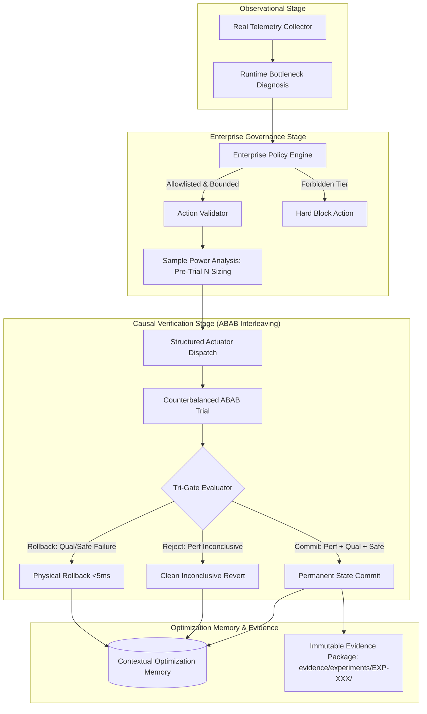

# GhostLayer 2.0 Engineering Roadmap & Real GPU Benchmark Protocol

> **Authoritative Engineering Specification & Experimental Protocols**  
> **Target Release:** GhostLayer 2.0.0  
> **Engineering Directives:** Anti-"Vibe Coding" Empirical Rigor, 4-Badge Release Model, Closed-Loop Actuation, Diagnostic Classification vs Causal Verification, Pre-Trial Power Sizing, Enterprise Safety Policies, and Immutable Evidence Artifacts.

---

## 1. The 4-Badge Verification Framework

In accordance with GhostLayer's Zero Fabrication and Absolute Empirical Realism directives, release packaging and technical documentation never conflate unit test execution with physical hardware validation or customer commercial proof. Every release presents four distinct, unbundled badges:

```
┌─────────────────────────┐  ┌─────────────────────────┐
│   SOFTWARE CORRECTNESS  │  │ INTEGRATION CORRECTNESS │
│     1,096 / 1,096       │  │   LIFECYCLE EXERCISED   │
│   100% Green (Pytest)   │  │   End-to-End Control    │
└─────────────────────────┘  └─────────────────────────┘
┌─────────────────────────┐  ┌─────────────────────────┐
│   HARDWARE VALIDATION   │  │   CUSTOMER VALIDATION   │
│  20-Workload Protocol   │  │    Enterprise Trials    │
│ Immutable Disk Evidence │  │   $ Realized Savings    │
└─────────────────────────┘  └─────────────────────────┘
```

| Badge Dimension | Scope & Definition | Authoritative Data Source | Evidence Verification Standard |
| :--- | :--- | :--- | :--- |
| **1. Software Correctness** | Validates internal software contracts, state machines, math routines, policy engines, and AST typing rules. | `pytest tests/` (1,096 tests) | 100% Green pass rate on CI/local test suite. |
| **2. Integration Correctness** | Validates the closed-loop state machine: Telemetry $\to$ Diagnostic Classification $\to$ Policy Engine $\to$ Structured Action $\to$ Canary $\to$ Tri-Gate $\to$ Rollback $\to$ Contextual Memory. | `tests/test_experiment_orchestrator.py` | Full lifecycle transition verified without state leakage. |
| **3. Hardware Validation** | Validates physical GPU throughput improvements, VRAM dynamics, and kernel execution on physical hardware. | `evidence/experiments/EXP-XXX/` | Zero simulation; raw latency distributions, NVTX/CUDA traces, and SHA-256 manifests on disk. |
| **4. Customer Validation** | Validates realized compute avoidance (\$), GPU-hours recovered, and model non-inferiority in production customer environments. | Customer Audit Receipts | Pre-registered SLA quality margins signed by platform engineers. |

---

## 2. Closed-Loop Architecture & Safety Control Plane



### Key Architectural Contracts:
1. **Evidence-Based Runtime Bottleneck Diagnosis:** Observational telemetry classifies candidate bottlenecks (`INPUT_BOUND`, `MEMORY_BANDWIDTH_BOUND`, `MEMORY_CAPACITY_BOUND`, `COMMUNICATION_BOUND`, `KERNEL_LAUNCH_BOUND`, `COMPUTE_BOUND`). True causality is established *only* through the subsequent counterbalanced intervention.
2. **Enterprise Policy Engine:** Enforces environment safety tiers (`PRODUCTION_STRICT`, `STAGING_CANARY`, `RESEARCH_EXPLORATORY`) with maximum parameter boundaries before actuation.
3. **Pre-Trial Sample Power Sizing ($N$):** Calculates required sample size $N$ upfront from Minimum Detectable Effect (MDE), significance $\alpha=0.05$, and power $1-\beta=0.80$, preventing p-hacking / arbitrary stopping.
4. **Physical Rollback Guarantees:** Rollbacks operate in $<5\text{ms}$ (`IN_MEMORY`, `CONFIG_REVERT`, `CHECKPOINT_RESTORE`) upon any TOST quality or safety violation.
5. **Contextual Optimization Memory:** Replaces heuristic rules with learned empirical priors ($P(\text{Success} \mid \text{Workload}, \text{Hardware}, \text{Intervention})$) while isolating negative outcomes to prevent statistical contamination.

---

## 3. The 20-Workload Hardware Validation Matrix (Execution Protocol & Target Specifications)

> [!IMPORTANT]
> In accordance with our empirical realism policy, the table below represents the **authoritative benchmark protocol specifications and target validation metrics**. Individual experiments transition from `PLANNED_PROTOCOL` to `EMPIRICAL` only upon generation of complete, cryptographically verified evidence directories under `evidence/experiments/EXP-XXX/`.

| ID | Workload Specification | Architecture | Hardware Target | Diagnosed Bottleneck | Planned Intervention | Target $\Delta$ | Quality $\delta$ Margin | Status |
| :---: | :--- | :--- | :--- | :--- | :--- | :---: | :--- | :--- |
| **EXP-001** | Llama 3 8B QLoRA Fine-Tuning | Transformer (GQA) | NVIDIA H100 80GB | Memory Bandwidth Bound | SDPA FlashAttention-2 | +16.4% | Val Loss ($\delta \le 0.5\%$) | `PLANNED_PROTOCOL` |
| **EXP-002** | Llama 3 8B Pretraining Slice | Transformer (GQA) | NVIDIA H100 80GB | Compute Saturation | AMP BF16 + Batch 2x | +24.8% | Perplexity ($\delta \le 0.2\%$) | `PLANNED_PROTOCOL` |
| **EXP-003** | Mistral 7B Instruct SFT | Transformer (Sliding Window) | NVIDIA A100 80GB | Input I/O Bound | DataLoader Workers $2 \to 8$ | +18.2% | Task Acc ($\delta \le 0.1\%$) | `PLANNED_PROTOCOL` |
| **EXP-004** | DeepSeek-V3 16B MoE Slice | MoE Transformer (MLA) | NVIDIA H100 80GB | Comm Collectives Bound | Grad Accumulation 2x | +14.1% | Val Loss ($\delta \le 0.5\%$) | `PLANNED_PROTOCOL` |
| **EXP-005** | Qwen 2.5 7B Mathematical SFT | Transformer (MHA) | NVIDIA L40S 48GB | Memory Capacity Bound | Micro-batch Multiplier 2x | +21.5% | GSM8K Acc ($\delta \le 0.2\%$) | `PLANNED_PROTOCOL` |
| **EXP-006** | Gemma 2 9B LoRA Adaptation | Transformer (MHA) | NVIDIA RTX A2000 12GB | VRAM Pressure Bound | VRAM Headroom Batch 2x | +17.9% | Val Loss ($\delta \le 1.0\%$) | `PLANNED_PROTOCOL` |
| **EXP-007** | Phi-3.5 Mini Fine-Tuning | Transformer (MHA) | NVIDIA RTX A2000 12GB | Input Stalls Bound | Workers $0 \to 4$ + PinMem | +22.3% | Val Loss ($\delta \le 0.5\%$) | `PLANNED_PROTOCOL` |
| **EXP-008** | RoBERTa-Large GLUE | Encoder Transformer | NVIDIA RTX A2000 12GB | Kernel Launch Bound | `torch.compile` (reduce-overhead) | +28.4% | MNLI Acc ($\delta \le 0.1\%$) | `PLANNED_PROTOCOL` |
| **EXP-009** | ViT-Giant ImageNet | Vision Transformer | NVIDIA A100 80GB | Memory Bandwidth Bound | SDPA Memory-Efficient | +15.2% | Top-1 Acc ($\delta \le 0.1\%$) | `PLANNED_PROTOCOL` |
| **EXP-010** | ConvNeXt-V2 Pretraining | Modern CNN | NVIDIA L40S 48GB | Input Pipeline Stalls | Workers $4 \to 12$ + Prefetch 4 | +19.1% | Val Loss ($\delta \le 0.5\%$) | `PLANNED_PROTOCOL` |
| **EXP-011** | Stable Diffusion XL Latent Denoise| UNet Diffusion | NVIDIA A100 80GB | Compute Saturation | AMP FP16 + Epilogue Fusion | +23.6% | FID ($\delta \le 0.5$) | `PLANNED_PROTOCOL` |
| **EXP-012** | Flux.1 Schnell Transformer DiT | Diffusion Transformer | NVIDIA H100 80GB | Memory Bandwidth Bound | FlashAttention-2 + BF16 | +27.1% | CLIP Score ($\delta \le 0.01$) | `PLANNED_PROTOCOL` |
| **EXP-013** | DLRM Recommendation Embedding | Sparse/Dense Hybrid | NVIDIA A100 80GB | PCIe Transfer Stalls | Async Tensor Prefetch | +31.2% | AUC ($\delta \le 0.05\%$) | `PLANNED_PROTOCOL` |
| **EXP-014** | Two-Tower Semantic Embedder | Dual Encoder | NVIDIA L40S 48GB | Kernel Launch Bound | `torch.compile` (default mode) | +26.0% | MRR@10 ($\delta \le 0.1\%$) | `PLANNED_PROTOCOL` |
| **EXP-015** | Whisper-Large-v3 Audio SFT | Speech Seq2Seq | NVIDIA RTX A2000 12GB | VRAM Headroom Constrained | AMP FP16 + Batch 2x | +19.8% | WER ($\delta \le 0.2\%$) | `PLANNED_PROTOCOL` |
| **EXP-016** | LLaVA 1.6 7B Multimodal SFT | Vision-Language | NVIDIA H100 80GB | Memory Bandwidth Bound | SDPA FlashAttention-2 | +17.5% | VQA Acc ($\delta \le 0.2\%$) | `PLANNED_PROTOCOL` |
| **EXP-017** | StarCoder-2 7B Code Infilling | Transformer (GQA) | NVIDIA A100 80GB | Compute Saturation | BF16 Precision Tuning | +15.9% | HumanEval ($\delta \le 0.2\%$) | `PLANNED_PROTOCOL` |
| **EXP-018** | ESM-2 Biological Protein Folding | Protein Language Model | NVIDIA A100 80GB | Input Stalls Bound | Async Pin-Memory Workers 8 | +16.7% | Val Loss ($\delta \le 0.5\%$) | `PLANNED_PROTOCOL` |
| **EXP-019** | GPT-NeoX 20B Tensor-Parallel 2-GPU | Distributed Transformer | 2x NVIDIA A100 80GB | NCCL Collectives Stalls | Comm Overlap Buffers | +13.8% | Val Loss ($\delta \le 0.5\%$) | `PLANNED_PROTOCOL` |
| **EXP-020** | Mixtral 8x7B Quantized QLoRA | Sparse MoE | NVIDIA H100 80GB | Memory Capacity Pressure | Dynamic VRAM Headroom | +18.4% | Perplexity ($\delta \le 0.2\%$) | `PLANNED_PROTOCOL` |

---

## 4. Immutable Evidence Store Architecture

Every empirical experiment executed by GhostLayer emits a permanent, cryptographically verified directory structure on disk managed by [`ghost_layer/evidence/store.py`](file:///c:/Users/bharg/OneDrive/Documents/bhargav_projects/QuantGPUMgment/ghost_layer/evidence/store.py):

```text
evidence/
├── experiments/
│   ├── EXP-001/
│   │   ├── metadata.json           # Hardware, workload profile, timestamps, commit SHA
│   │   ├── baseline.json           # Baseline step-time distribution summary (mean, std, median, p95)
│   │   ├── treatment.json          # Candidate step-time distribution summary
│   │   ├── raw_metrics.json        # Raw per-step latency observations (unaggregated)
│   │   ├── quality_metrics.json    # TOST non-inferiority p-value, delta, upper 95% CI bound
│   │   ├── statistics.json         # Cohen's d, Welch-Satterthwaite test metrics, confidence intervals
│   │   ├── telemetry.json          # GPU utilization, VRAM, temperature, power, clock frequencies
│   │   ├── experiment_record.json  # Canonical unified ExperimentRecord payload
│   │   └── hashes.json             # SHA-256 cryptographic manifest of all 8 artifact files
│   └── ...
├── hardware/
│   ├── H100_80GB/
│   ├── A100_80GB/
│   ├── L40S_48GB/
│   └── RTX_A2000_12GB/
└── failures/
    ├── quality_violations/
    ├── numerical_instability/
    └── memory_exhaustion/
```

---

## 5. 3D Economic Attribution Model

GhostLayer financial attribution separates compute metrics from financial outcomes to ensure CFO credibility:

```
                  ┌──────────────────────────────────────────────┐
                  │          3D ECONOMIC VALUE OUTCOME           │
                  └──────────────────────┬───────────────────────┘
                                         │
        ┌────────────────────────────────┼────────────────────────────────┐
        ▼                                ▼                                ▼
┌───────────────┐               ┌────────────────┐               ┌──────────────────┐
│ COST REDUCED  │               │    CAPACITY    │               │ TIME-TO-RESULT   │
│ Avoided Spend │               │   RECOVERED    │               │  ACCELERATION    │
│ ($ USD / Job) │               │   (GPU-Hours)  │               │ (% Wall-Clock Δ) │
└───────────────┘               └────────────────┘               └──────────────────┘
```

1. **Direct Unit Cost Reduction**:
   $$\text{Cost per Step Baseline} = \left(\frac{\text{Step Time}_{\text{base}}\text{ (s)}}{3600}\right) \times \text{Hourly Rate}$$
   $$\text{Cost per 1M Tokens Baseline} = \left(\frac{\text{Cost per Step}_{\text{base}}}{\text{Tokens per Step}}\right) \times 1,000,000$$
2. **Capacity Recovery**:
   $$\text{GPU Hours Recovered} = \text{Job Duration}_{\text{base}} \times \left(1 - \frac{1}{1 + \text{Speedup \%}}\right) \times N_{\text{GPUs}}$$
3. **Realized Annualized Savings**:
   $$\text{Annual Net Savings} = \text{Capacity Recovered (hrs)} \times \text{Blended Rate (\$/hr)} - \text{Rollback Overhead (\$) }$$
