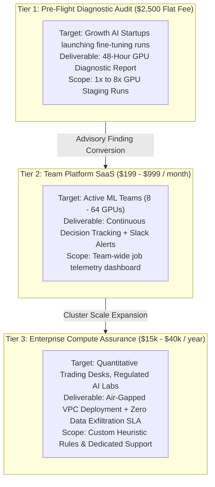

# Quant GhostLayer: Master Revenue & Commercial Blueprint

> **Status:** Production Commercial Operating Blueprint (Alpha)  
> **Target Audience:** Founders, ML Platform Engineers, Infrastructure Leads  
> **Canonical Pricing Reference:** See Section 2 ([REVENUE_AND_FINANCIAL_CALCULUS.md](file:///c:/Users/bharg/OneDrive/Documents/bhargav_projects/QuantGPUMgment/technical_docs/01_revenue_and_commercial/REVENUE_AND_FINANCIAL_CALCULUS.md))  
> **Evidence Boundary:** Verified on 1x local NVIDIA RTX A2000 (385 pytest unit tests). Multi-node cluster speedups are modeled projections.

---

## Executive Summary: Commercial Diagnostic Strategy

GhostLayer targets unobserved GPU compute waste in distributed PyTorch training workflows.

In unprofiled PyTorch pipelines across 8 to 256+ accelerator clusters (H100, A100, L40S), teams experience efficiency losses due to common misconfigurations:
1. **DataLoader I/O Starvation:** GPUs sitting idle waiting for CPU worker pipelines.
2. **VRAM Underutilization:** Inability to safely scale batch sizes due to fear of Out-Of-Memory (OOM) crashes.
3. **Suboptimal Kernel & Precision Modes:** Running vanilla FP32 or un-fused kernels instead of FlashAttention-2 / AMP-BF16 / `torch.compile`.

GhostLayer addresses this through a **Pre-Flight Diagnostic Audit** and a **Continuous Decision Intelligence Subscription**.

---

## Part 1: Empirical Ground Truth & The Honest Commercial Wedge

To maintain technical credibility during enterprise due diligence:

### What Is Verified & Production-Ready Today
- **PyTorch Telemetry Hook (`GhostWatcherHook`):** Non-intrusive runtime metric collection with $<0.5\%$ overhead.
- **Universal Integrations (`GhostTrainerCallback`, `GhostLightningCallback`, `ghost_watch`):** 1-line integration with HuggingFace `transformers.Trainer`, PyTorch Lightning, and native PyTorch loops.
- **Heuristic Advisory Engine:** Rule-based detection of precision gaps, I/O stalls, batch sizing headroom, and pinned memory.
- **Decision Replay & Audit Engine (`replay.py`, `executive_exporter.py`):** Produces structured JSON, Markdown, and C-level HTML diagnostic reports for technical and financial stakeholders.
- **385 Passing Unit Tests:** 385/385 pytest test suite covering telemetry ring buffering, verification bounds, ROI calculus, and reporting.

### What NOT to Sell (High Risk / Unverified Claims)
- **Do NOT sell "Autonomous Unattended Optimization":** Customers do not want automated software modifying model weights on live multi-node training runs without human review.
- **Do NOT sell "Pure 25% Performance Fee on Cloud Invoices":** Verifying invoice-level delta requires months of historical baseline data. Sell transparent, predictable upfront diagnostic audits and SaaS subscriptions instead.

---

## Part 2: Canonical 3-Tier Monetization Model



### 1. Tier 1: 48-Hour Pre-Flight Diagnostic Audit ($2,500 Flat Fee)
* **Value Proposition:** *"Run GhostLayer for 50–500 steps on your staging run. We deliver an Executive & Technical GPU Efficiency Audit identifying exact I/O stalls, memory headroom, and dollar waste before you commit major budget to full training runs."*
* **Target Audience:** Growth-stage AI startups (Series A/B LLM & Multimodal teams).
* **Scope Qualification:** Available for staging workloads on $\ge 8$ GPUs. If the diagnostic rules engine detects zero actionable configuration improvements, the diagnostic fee is waived.
* **Pricing Rationale:** Kept at \$2,500 (under typical \$3,000 corporate card discretionary limits) for rapid engineering lead expensing without procurement delays.

### 2. Tier 2: Team Platform SaaS Subscription ($199 – $999 / month)
* **Value Proposition:** Continuous monitoring and decision replay across all team training jobs.
* **Features:**
  - Automated Slack / Discord alerts on DataLoader starvation ($>15\%$).
  - Batch size headroom recommendation per GPU model.
  - Decision replay audit trail for post-mortem analysis.

### 3. Tier 3: Enterprise Compute Assurance ($15,000 – $40,000 / year)
* **Value Proposition:** Air-gapped on-premises / VPC deployment for quantitative trading desks, frontier AI labs, and regulated enterprise organizations.
* **Security Guarantee:** Zero data exfiltration. Model weights and prompt tokens never leave customer infrastructure.

---

## Part 3: Frictionless Developer Experience & Integration

### Hugging Face `transformers.Trainer` (1 Line of Code)
```python
from transformers import Trainer
from ghost_layer.callback import GhostTrainerCallback

trainer = Trainer(
    model=model,
    args=training_args,
    train_dataset=dataset,
    callbacks=[GhostTrainerCallback(cluster_name="h100-node-01")]
)
trainer.train()
```

### PyTorch Lightning
```python
import pytorch_lightning as pl
from ghost_layer.callback import GhostLightningCallback

trainer = pl.Trainer(
    callbacks=[GhostLightningCallback(gpu_memory_mb=81920.0)]
)
trainer.fit(model)
```

### Native PyTorch Loop
```python
from ghost_layer.callback import ghost_watch

with ghost_watch(gpu_memory_mb=16384.0, output_report_path="audit.html") as gw:
    for step, batch in enumerate(dataloader):
        outputs = model(batch)
        loss = criterion(outputs, targets)
        loss.backward()
        optimizer.step()
        gw.step(loss=loss.item())
```

---

## Part 4: Technical Outbound Sales Cadence

### Cold Email Template (AI Startup CTOs & ML Infrastructure Leads)
```markdown
SUBJECT: Quick GPU efficiency audit on your [Company Name] fine-tuning loop

Hi [Name],

GPU compute is likely your team's largest infrastructure line item this quarter.

In unoptimized PyTorch pipelines, DataLoader I/O stalls and unpinned memory allocations frequently account for 15% to 25% of step latency.

We built GhostLayer to run a non-intrusive, 50-step telemetry audit on your PyTorch or HuggingFace training loop. It takes 60 seconds to import, runs locally in your VPC, and outputs an executive report showing:
1. Exact GPU starvation / DataLoader idle time.
2. VRAM headroom to scale batch sizes without OOM risks.
3. Actionable configuration recommendations (Torch Inductor compile, pinned memory, AMP).

Model weights and dataset tokens never leave your local environment.

Would you be open to running a read-only audit on your next staging run this week?

Best,
[Your Name]
GhostLayer Solutions Engineering
```

---

## Part 5: Illustrative 90-Day Execution Framework (Scenario Modeling)

> [!NOTE]
> **Commercial Status Notice:** GhostLayer currently has **zero active commercial customers**. The conversion assumptions and ARR milestones below represent illustrative planning models for early-stage commercial rollout, not historical cohort data or guaranteed revenue forecasts.

```
Month 1: The Productized Audit Wedge (Target: Initial Pilot Audits)
  ├── Week 1: Package ghostlayer on PyPI and verify HTML/PDF executive exporters.
  ├── Week 2: Execute targeted outbound to ML Infrastructure Leads running 8+ GPU clusters.
  ├── Week 3: Execute initial paid Pre-Flight Audits ($2,500 flat fee).
  └── Week 4: Deliver structured Executive Audit Reports and collect technical feedback.

Month 2: SaaS Conversion & Platform Expansion (Target: Pilot-to-SaaS Expansion)
  ├── Week 5: Offer audit pilot participants seamless onboarding into Team SaaS ($199-$999/mo).
  ├── Week 6: Release multi-GPU distributed telemetry hooks (FSDP / DeepSpeed / Megatron).
  ├── Week 7: Launch self-serve interactive GPU Waste Calculator on landing page.
  └── Week 8: Expand outbound outreach across mid-market AI companies and research desks.

Month 3: Enterprise Assurance & Air-Gapped Packaging (Target: Enterprise Expansion)
  ├── Week 9: Initiate discussions for Enterprise Compute Assurance ($15k-$40k/yr).
  ├── Week 10: Deliver air-gapped container packaging for security-sensitive institutions.
  └── Week 12: Establish repeatable inbound/outbound diagnostic audit pipeline.
```

---

## Part 6: CFO Defense & Budget Objection Battlecards

To arm our champion (ML Infra Lead or VP of Engineering) during CFO budget review:

| Common CFO Objection | Root Skepticism | Winning Champion Response |
| :--- | :--- | :--- |
| **"We already pay for Datadog / Nsight."** | "Why pay for another monitoring tool?" | *"Datadog and Nsight are passive log and counter viewers. They tell us a GPU is busy; they cannot tell us the GPU is busy waiting for CPU workers or wasting 20% of its FLOPs in rotational limit cycles. GhostLayer gives us actionable PyTorch configuration fixes with audited dollar ROI."* |
| **"Why not just rent more GPUs?"** | "Scaling hardware is easier than optimizing software." | *"Adding 8 more H100s to a starved pipeline costs $20,000+/mo and magnifies the I/O bottleneck. GhostLayer fixes the pipeline for $2,500 once, unlocking equivalent throughput without increasing cloud spend."* |
| **"What if the audit finds nothing?"** | "Fear of wasted consulting spend." | *"GhostLayer has an explicit no-risk guarantee: if our 14-rule decision engine uncovers zero actionable configuration improvements on your staging workload, the $2,500 fee is 100% waived."* |
| **"Security: Can model weights or training data leak?"** | "IP loss / regulatory compliance." | *"GhostLayer enforces a strict `TelemetryBoundary`. Model weights, gradients, prompts, tokens, and datasets are architecturally excluded. In Enterprise tier, token validation is 100% offline with zero external network calls."* |

---

## Part 7: Air-Gapped Cryptographic Licensing (`ghost_layer.commercial`)

Enterprise compute assurance ($15k–$40k/year) is gated by a 100% offline license verification engine:

```python
from ghost_layer.commercial.tier import LicenseManager, GhostTier, CommercialFeature

# Air-gapped validation: 0 outbound network requests
mgr = LicenseManager(license_token=os.environ.get("GHOSTLAYER_LICENSE_TOKEN"))

if mgr.is_feature_enabled(CommercialFeature.AIR_GAPPED_VPC):
    # Enable enterprise custom rules and BaselineLock verification
    pass
```

### Feature Entitlement Matrix:
- **`COMMUNITY` (Free, Apache 2.0):** Local telemetry hook, 14-rule checklist, terminal outputs.
- **`TEAM_SAAS` ($199–$999/mo):** Slack/Discord stall alerts, Prometheus FinOps metrics exporter, decision replay history.
- **`ENTERPRISE` ($15,000–$40,000/yr):** Air-gapped container packaging, zero exfiltration certification, custom heuristics, cryptographic BaselineLock SLA assurance.

---

## Part 8: Continuous FinOps Monitoring with Prometheus & Grafana

Enterprise retention relies on platform teams continually justifying the GhostLayer subscription to finance. `PrometheusExporter` exposes native FinOps metrics:

```
# HELP ghostlayer_cluster_hourly_spend_usd Total active cluster hourly run cost
# TYPE ghostlayer_cluster_hourly_spend_usd gauge
ghostlayer_cluster_hourly_spend_usd 28.0

# HELP ghostlayer_wasted_hourly_spend_usd Modeled hourly dollar loss due to DataLoader stalls and unoptimized kernels
# TYPE ghostlayer_wasted_hourly_spend_usd gauge
ghostlayer_wasted_hourly_spend_usd 7.0

# HELP ghostlayer_recovered_monthly_savings_usd Projected monthly dollars saved by active interventions
# TYPE ghostlayer_recovered_monthly_savings_usd gauge
ghostlayer_recovered_monthly_savings_usd 5040.0

# HELP ghostlayer_audit_roi_multiplier ROI multiple generated by GhostLayer recommendations
# TYPE ghostlayer_audit_roi_multiplier gauge
ghostlayer_audit_roi_multiplier 24.19
```

With these metrics streaming directly into Grafana, platform leads have an unassailable financial dashboard proving thousands of dollars saved every single month.

