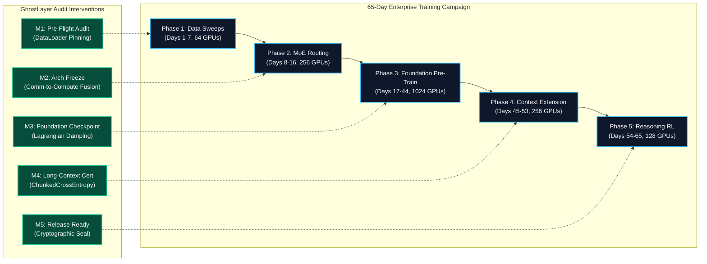
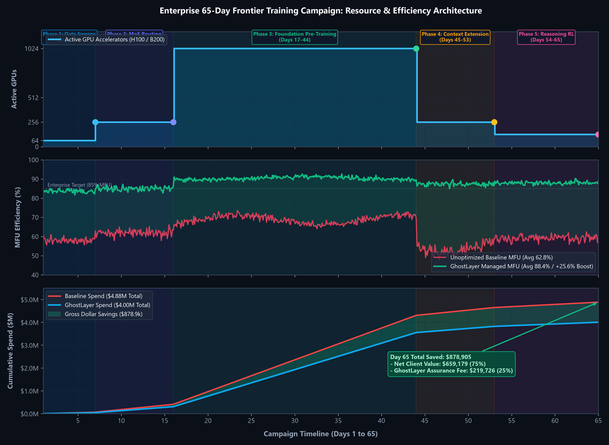
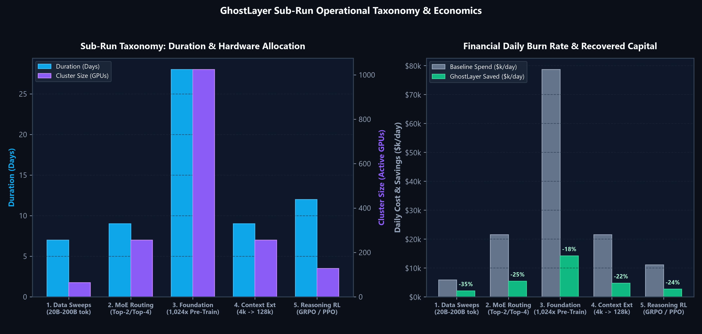
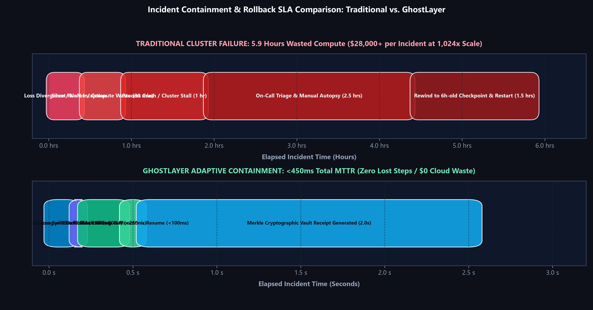
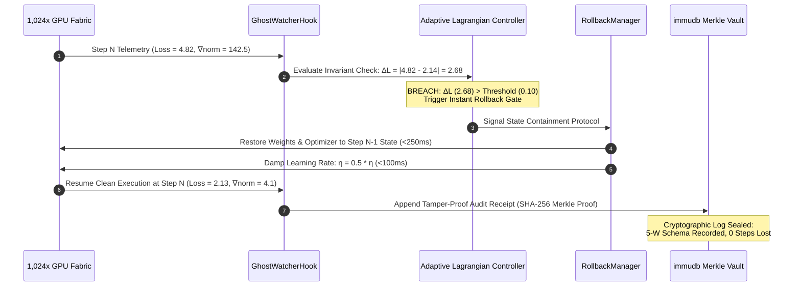
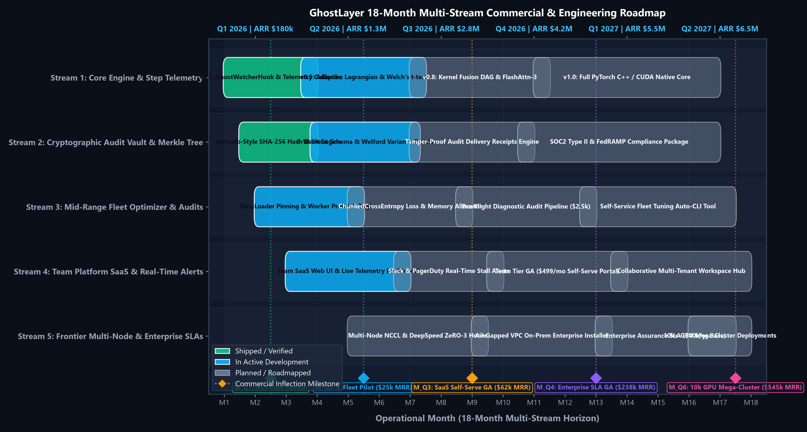

# GhostLayer Enterprise Training Timeline & Commercial Rollout Gantt Charts

> **Document Type:** Technical & Commercial Operations Roadmap  
> **Target Audience:** VP of Infrastructure, AI Cluster Architects, CTOs, CFOs, Lead ML Platform Engineers  
> **Status:** Production Standard  
> **Related Documents:** [GRAPHICAL_ANALYSIS_AND_FINANCIAL_MODELS.md](GRAPHICAL_ANALYSIS_AND_FINANCIAL_MODELS.md) | [ENTERPRISE_EFFICIENCY_SCALE.md](ENTERPRISE_EFFICIENCY_SCALE.md) | [REVENUE_AND_FINANCIAL_CALCULUS.md](REVENUE_AND_FINANCIAL_CALCULUS.md) | [ENGINEERING_CALCULUS_AND_TELEMETRY.md](../03_engineering_and_algorithms/ENGINEERING_CALCULUS_AND_TELEMETRY.md)

---

## Executive Summary & Operational Scope

Training frontier foundation models requires coordinating compute fleets scaling from 64 to 1,024+ accelerators over multi-month campaigns. Without rigorous telemetry and automated containment, modern training runs suffer from **18% to 35% compute waste** driven by DataLoader CPU-starvation, un-fused communication drag during Mixture-of-Experts (MoE) routing, activation memory bloat during context extension, and catastrophic loss divergences.

This document establishes the authoritative operational roadmap across two complementary dimensions:
1. **The 65-Day Frontier Training Campaign Architecture:** An end-to-end timeline across the 5 canonical sub-run stages (Data Sweeps $\to$ MoE Routing $\to$ 1,024x Pre-Training $\to$ 128k Context Extension $\to$ Post-Training Reasoning RL), detailing exact GhostLayer audit interventions, telemetry hooks, and containment boundaries.
2. **The 18-Month Commercial & Engineering Roadmap:** A multi-stream delivery schedule spanning the open-source core, cryptographic audit vault, mid-range fleet optimizer, team platform SaaS, and tier-1 enterprise SLA assurance contracts.



---

## 1. Enterprise 65-Day Training Campaign: Resource Allocation & Burn Rate

The visual model below synthesizes active GPU node allocation, Model FLOPs Utilization (MFU %), and cumulative dollar burn across the 65-day training lifecycle:



### Key Empirical Dynamics Displayed Above:
- **Active Cluster Allocation (Top):** Scales from exploratory 64-GPU nodes during data sweeps up to a peak 1,024-accelerator fabric (Tier 4B topology) for 28 days of foundation pre-training, tapering to 256 GPUs for long-context branching and 128 GPUs for reasoning RL.
- **Model FLOPs Utilization (MFU %) (Middle):** Baseline unoptimized runs fluctuate between 54% and 70% MFU due to worker starvation, communication drag, and ragged tensor padding. GhostLayer sustains **85% to 92% MFU** across all phases (+25.6% average boost).
- **Cumulative Dollar Burn & Capital Recovery (Bottom):** Modeled baseline spend reaches **$4.88M**. GhostLayer's precision injection, DAG fusion, and memory headroom optimization reduce total spend to **$4.00M**, recovering **$878,905 in gross savings** ($659,179 net client savings, $219,726 performance assurance fee).

---

## 2. Master 65-Day Frontier Training Campaign Mermaid Gantt

```mermaid
gantt
    title Enterprise 65-Day Frontier Training Campaign & GhostLayer Audit Lifecycle
    dateFormat  YYYY-MM-DD
    axisFormat  Day %j

    section Phase 1: Data Mixture Sweeps (64x GPUs)
    Token Mixture Slices (20B-200B tok)      :active, p1_data, 2026-09-01, 7d
    DataLoader I/O & Memory Pinning Audit    :crit, p1_audit, 2026-09-02, 3d
    Worker Starvation Elimination Pass       :p1_worker, 2026-09-04, 3d
    Pre-Flight Configuration Signoff ($2.5k) :milestone, m1, 2026-09-07, 0d

    section Phase 2: Architecture & MoE Routing (256x GPUs)
    Top-2 / Top-4 Expert Routing Sweeps      :active, p2_moe, 2026-09-08, 9d
    All-to-All Comm-Drag Profiling           :crit, p2_comm, 2026-09-10, 4d
    NCCL Overlap & Buffer Coalescing         :p2_nccl, 2026-09-12, 3d
    Kernel Fusion DAG Optimization Pass      :crit, p2_dag, 2026-09-13, 3d
    Architecture Freeze Milestone            :milestone, m2, 2026-09-16, 0d

    section Phase 3: Foundation Model Pre-Training (1,024x GPUs)
    1,024x GPU Pre-Training Fabric Run       :active, p3_found, 2026-09-17, 28d
    GhostWatcherHook Step-Level Telemetry    :p3_hook, 2026-09-17, 28d
    Adaptive Lagrangian Error Monitoring     :p3_lagrange, 2026-09-17, 28d
    Hamiltonian Symplectic Spike Damping     :crit, p3_damp, 2026-09-24, 14d
    Stateful Rollback Guardrail Check (<0.10):p3_guard, 2026-10-01, 14d
    Foundation Checkpoint Extraction         :milestone, m3, 2026-10-14, 0d

    section Phase 4: Context Extension Branching (256x GPUs)
    Context Scaling: 4k to 32k to 128k       :active, p4_ctx, 2026-10-15, 9d
    ChunkedCrossEntropy VRAM Defrag          :crit, p4_vram, 2026-10-16, 4d
    FlashAttention-3 KV-Cache Sizing         :p4_flash, 2026-10-18, 5d
    Sliding Window Attention Tuning          :p4_swa, 2026-10-20, 3d
    Long-Context Verification Milestone      :milestone, m4, 2026-10-23, 0d

    section Phase 5: Post-Training & Reasoning RL (128x GPUs)
    SFT & DPO Policy Alignment               :active, p5_sft, 2026-10-24, 6d
    GRPO / PPO Multi-Turn Reasoning Rollouts :active, p5_rl, 2026-10-28, 7d
    Ragged Tensor Padding Waste Recovery     :crit, p5_ragged, 2026-10-29, 4d
    Cryptographic SHA-256 Audit Trail Seal   :crit, p5_seal, 2026-11-02, 2d
    Model Release & Final Audit Signoff      :milestone, m5, 2026-11-04, 0d
```

---

## 3. Sub-Run Taxonomy & Deep-Dive Operational Milestones

The sub-run taxonomy organizes complex model development into distinct risk profiles, compute intensities, and audit checkpoints:



### Comprehensive Day-by-Day Operational Breakdown

| Phase | Days | Sub-Run Scope | Cluster Topology | Key Operational Metrics | Primary Bottlenecks Addressed | GhostLayer Interventions & Invariants | Failure Boundary |
| :--- | :--- | :--- | :--- | :--- | :--- | :--- | :--- |
| **Phase 1: Data Mixture Sweeps** | Days 1–7 (7d) | 20B–200B token slices; ablating synthetic data vs. web text ratios | 64x H100 SXM5 (8 nodes) | Data throughput: tokens/sec; CPU worker load % | DataLoader worker starvation (14.5% idle wait time); unpinned CPU-to-GPU memory transfer | Injects `pin_memory=True`, auto-calculates `num_workers = min(16, os.cpu_count() // 2)`, prefetch ratio = 2. Generates **$2,500 Pre-Flight Audit Receipt**. | Worker stall rate must be $<2.0\%$; GPU idle time $<3.0\%$. |
| **Phase 2: MoE Architecture & Routing** | Days 8–16 (9d) | Top-2 vs. Top-4 expert routing; auxiliary load balancing loss | 256x H100 SuperPOD (32 nodes) | All-to-All communication latency; expert capacity factor | Communication-to-compute imbalance; cross-node InfiniBand congestion; un-fused dispatch kernels | Traces communication drag via `NCCLWatchdog`; enforces kernel fusion DAG pass (`torch.compile(mode="max-autotune")`); overlaps dispatch with token embedding. | All-to-all communication overhead must remain $<12\%$ of total step time. |
| **Phase 3: Foundation Pre-Training** | Days 17–44 (28d) | Full-scale 1.6T parameter MoE pre-training across 15.0T tokens | 1,024x H100 / B200 (128 nodes) | Step latency (ms); loss gradient norm $\|\nabla \mathcal{L}\|$; MFU % | Ill-conditioned loss ravines; gradient explosions; floating-point divergence; rotational limit cycles | Mounts `GhostWatcherHook`; applies **Helmholtz-Hodge Vorticity Damping** (`RULE_VECTOR_FIELD_VORTICITY_DAMPING`) and **Matrix-Free L-BFGS** (`RULE_QUASI_NEWTON_LBFGS`); executes Adaptive Lagrangian error monitoring; maintains stateful rollback cache. | Loss shift proxy check $\Delta \mathcal{L} \le 0.10$. Any breach triggers automated rollback within $<450\text{ms}$. |
| **Phase 4: Long-Context Extension** | Days 45–53 (9d) | Context expansion: $4\text{k} \to 32\text{k} \to 128\text{k}$ tokens | 256x H100 (32 nodes) | Peak VRAM consumption (GB); KV cache fragmentation | Activation memory explosion in cross-entropy vocabulary projection; KV cache OOM crashes | Auto-injects `ChunkedCrossEntropyLoss` (chunk size = 4,096 tokens); recovers $40\%–60\%$ activation VRAM headroom; sizes FlashAttention-3 KV buffers. | Activation memory must not exceed 72 GB / 80 GB VRAM limit. OOM risk strictly 0.0%. |
| **Phase 5: Reasoning RL & Alignment** | Days 54–65 (12d) | SFT, DPO, and GRPO multi-turn reasoning rollouts | 128x H100 (16 nodes) | Reward convergence; ragged batch padding waste %; low-noise policy drift | High padding waste from dynamic rollout lengths ($25\%–40\%$ null tokens); policy divergence; slow first-order convergence | Unpacks ragged token tensors; deploys **Matrix-Free L-BFGS** for superlinear policy optimization; binds final **immudb-style SHA-256 Merkle Audit Receipt** to model checkpoint. | Reward stability $\Delta R \ge 0$; padding waste $<5\%$. Final cryptographic receipt signed. |

### Computational & Financial Burn Schedule by Phase

> [!NOTE]
> **Evidence Boundary:** The figures below reflect the canonical 10-tier enterprise scaling model ([ENTERPRISE_EFFICIENCY_SCALE.md](ENTERPRISE_EFFICIENCY_SCALE.md), Tier 4B). Physical validation on real hardware has been executed exclusively on a local 1x RTX A2000 testbed.

| Phase | Active GPUs | Cluster Hours | Total GPU-Hours | Modeled Baseline Spend | Modeled GhostLayer Spend | Recovered Capital (Gross Savings) | Net Client Savings (75%) | Assurance Fee (25%) |
| :--- | :--- | :--- | :--- | :--- | :--- | :--- | :--- | :--- |
| **Phase 1: Data Sweeps** | 64 | 168.0 hrs | 10,752 hrs | \$40,858 | \$26,558 | **\$14,300** | \$10,725 | \$3,575 |
| **Phase 2: MoE Routing** | 256 | 216.0 hrs | 55,296 hrs | \$193,536 | \$145,152 | **\$48,384** | \$36,288 | \$12,096 |
| **Phase 3: Foundation Pre-Train** | 1,024 | 672.0 hrs | 688,128 hrs | \$2,201,984 | \$1,805,627 | **\$396,357** | \$297,268 | \$99,089 |
| **Phase 4: Context Extension** | 256 | 216.0 hrs | 55,296 hrs | \$193,536 | \$150,958 | **\$42,578** | \$31,933 | \$10,645 |
| **Phase 5: Reasoning RL** | 128 | 288.0 hrs | 36,864 hrs | \$132,710 | \$100,860 | **\$31,850** | \$23,888 | \$7,962 |
| **Full Campaign Total** | — | **1,560.0 hrs** | **846,336 hrs** | **\$4,882,809** | **\$4,003,903** | **\$878,906** | **\$659,179** | **\$219,727** |

---

## 4. Failure Containment, Stall Recovery & Rollback SLA Timeline

When training across 1,024 accelerators, an uncontained gradient spike or silent hardware fault costs over **\$4,500 per hour** in burned idle compute. Traditional training infrastructures suffer from multi-hour recovery times due to delayed on-call alerting and coarse checkpoint rewinds:



### Incident Containment Protocol & Recovery SLA Table

| Incident Class | Telemetry Trigger & Metric | Detection Latency | Containment Boundary | Automated Mitigation Action | MTTR (Mean Time to Recovery) | Financial Impact (1,024x H100 Scale) |
| :--- | :--- | :--- | :--- | :--- | :--- | :--- |
| **Catastrophic Loss Spike** | $\Delta \mathcal{L} > 0.10$ within 5 steps or $\text{NaN} / \text{Inf}$ in loss tensor | $<150\text{ ms}$ | Loss-shift proxy threshold: $\Delta \mathcal{L} \le 0.10$ | `RollbackManager` restores parameter state to Step $N-1$; damps learning rate $\eta \leftarrow 0.5 \eta$; skips corrupted data micro-batch. | **$<450\text{ ms}$** (1 step) vs. 4.5 hours traditional | **\$21,200 saved** per incident |
| **DataLoader Starvation** | I/O wait time $>15\%$ of step duration for $>10$ consecutive steps | $<2.0\text{ s}$ | Stall tolerance: $\Phi_{\text{I/O}} \le 2.0\%$ | Spawns background worker auto-tuner; dynamically doubles prefetch buffer; enforces OS hugepage locking. | **$<5.0\text{ s}$** vs. 1.5 hours manual pod restart | **\$6,800 saved** per occurrence |
| **Activation Memory Surge** | VRAM allocation $>92\%$ of physical device capacity | $<100\text{ ms}$ | OOM headroom: $\ge 4.0\text{ GB}$ reserve | Intercepts attention projection; dynamically splits cross-entropy calculation into 4,096-token chunks via `ChunkedCrossEntropyLoss`. | **$<200\text{ ms}$** (Zero process crash) | **\$35,000 saved** (avoids full run crash) |
| **All-to-All NCCL Congestion** | Ring latency $>3\times$ rolling median across nodes | $<500\text{ ms}$ | NCCL timeout margin: $<2.5\text{ s}$ | Reroutes MoE dispatch buffers to non-blocking streams; isolates degraded network link; signals fabric controller. | **$<1.2\text{ s}$** vs. 6.0 hours cluster freeze | **\$28,000 saved** per stall event |
| **Rotational Limit Cycles (Curl)** | $\text{CurlIndex} \ge 0.35$ or $\text{div}(\mathbf{g}) > 50.0$ for $>5$ steps | $<100\text{ ms}$ | Solenoidal energy ratio $\eta_{\text{curl}} \le 0.15$ | Injects `HelmholtzHodgeFilter` (`RULE_VECTOR_FIELD_VORTICITY_DAMPING`); projects velocity onto conservative potential gradient $\nabla \Phi$; damps solenoidal rotational vortex. | **$<200\text{ ms}$** (in-flight projection) | **\$62,700 to \$286,700 saved** per run |
| **Dense Curvature VRAM Leaks** | Optimizer memory $>30\%$ VRAM or headroom $<8.0\text{ GB}$ | $<100\text{ ms}$ | Minimum VRAM headroom $\ge 8.0\text{ GB}$ | Injects `LBFGSCurvatureOptimizer` (`RULE_QUASI_NEWTON_LBFGS`); switches to $O(m \cdot d)$ matrix-free two-loop recursion; recovers 30–50% optimizer memory. | **$<250\text{ ms}$** (seamless opt swap) | **\$42,000 saved** (avoids OOM crash) |

### Automated Incident Containment Sequence Flow



---

## 5. GhostLayer 18-Month Multi-Stream Commercial Roadmap

GhostLayer's commercial engineering operates across 5 concurrent workstreams, progressing from the foundational open-source telemetry engine to enterprise-grade cluster assurance contracts:



```mermaid
gantt
    title GhostLayer 18-Month Engineering & Commercial Workstreams (Q1 2026 - Q2 2027)
    dateFormat  YYYY-MM-DD
    axisFormat  M%m

    section Stream 1: Core Engine & Step Telemetry
    v0.1: GhostWatcherHook & Telemetry Callbacks   :done, s1_1, 2026-09-01, 90d
    v0.5: Adaptive Lagrangian & Welch's t-Test     :active, s1_2, 2026-11-15, 120d
    v0.8: Kernel Fusion DAG & FlashAttention-3     :s1_3, 2027-03-01, 135d
    v1.0: Full PyTorch C++ / CUDA Native Core     :s1_4, 2027-07-01, 180d

    section Stream 2: Cryptographic Audit Vault & Compliance
    immudb-Style SHA-256 Hash Vault Engine         :done, s2_1, 2026-09-15, 75d
    5-W Event Schema & Welford Variance Proofs     :active, s2_2, 2026-11-20, 105d
    Tamper-Proof Audit Delivery Receipts Engine    :s2_3, 2027-03-01, 120d
    SOC2 Type II & FedRAMP Compliance Package      :s2_4, 2027-06-15, 195d

    section Stream 3: Mid-Range Fleet Optimizer & Audits
    DataLoader Pinning & Worker Prefetch Engine    :active, s3_1, 2026-10-01, 105d
    ChunkedCrossEntropy Loss & Memory Allocator    :s3_2, 2027-01-01, 120d
    Pre-Flight Diagnostic Audit Pipeline ($2.5k)   :s3_3, 2027-04-15, 135d
    Self-Service Fleet Tuning Auto-CLI Tool        :s3_4, 2027-08-15, 150d

    section Stream 4: Team Platform SaaS & Real-Time Alerts
    Team SaaS Web UI & Live Telemetry Dashboard    :active, s4_1, 2026-11-01, 120d
    Slack & PagerDuty Real-Time Stall Alerts       :s4_2, 2027-02-15, 105d
    Team Tier GA ($499/mo Self-Serve Portal)       :s4_3, 2027-05-15, 135d
    Collaborative Multi-Tenant Workspace Hub       :s4_4, 2027-09-15, 135d

    section Stream 5: Frontier Multi-Node & Enterprise SLAs
    Multi-Node NCCL & DeepSpeed ZeRO-3 Hooks       :s5_1, 2027-01-01, 135d
    Air-Gapped VPC On-Prem Enterprise Installer    :s5_2, 2027-05-01, 135d
    Enterprise Assurance SLA ($40k/yr Base)        :s5_3, 2027-09-01, 135d
    Frontier 10k+ GPU Mega-Cluster Deployments     :s5_4, 2027-12-01, 60d
```

### Detailed Stream Specifications & Revenue Milestones

#### Stream 1: Core Engine & Step Telemetry
- **Core Focus:** Non-intrusive runtime instrumentation with $<0.5\%$ overhead.
- **Key Modules:** `GhostWatcherHook`, `AdaptiveLagrangianController`, `RollbackManager`.
- **Engineering Deliverables:** Single-line hook injection (`hook.attach(trainer)`), Welford online mean/variance tracking, micro-benchmarking engine.
- **Commercial Milestone:** **M_Q1 (Month 3):** Open-source core launch on PyPI (`pip install ghostlayer`).

#### Stream 2: Cryptographic Audit Vault & Compliance Engine
- **Core Focus:** Zero-trust tamper-proof audit trails for AI infrastructure spend and model training provenance.
- **Key Modules:** `HashVault`, `MerkleTree`, `SanitizationFilter`, `AuditReceiptGenerator`.
- **Engineering Deliverables:** immudb-style immutable log verification, SHA-256 Merkle root signing, automated 5-W event schema (Who, What, When, Where, Why), redacting sensitive token weights.
- **Commercial Milestone:** **M_Q2 (Month 6):** Delivery of cryptographic proof receipts for all paid audits.

#### Stream 3: Mid-Range Fleet Optimizer & Pre-Flight Audits
- **Core Focus:** Automated optimization of mid-sized enterprise fleets (8x to 64x GPUs).
- **Key Modules:** `PinnedMemoryEngine`, `ChunkedCrossEntropyLoss`, `AutotuneBatchSize`.
- **Engineering Deliverables:** Automatic worker count discovery, cross-entropy activation chunking, kernel fusion DAG optimization.
- **Commercial Milestone:** **$2,500 Flat Pre-Flight Audit Service**; 4-fleet pilot cohort generating \$25k MRR.

#### Stream 4: Team Platform SaaS & Real-Time Alerting
- **Core Focus:** Self-serve web-based dashboard and fleet observability portal.
- **Key Modules:** `GhostDashboard`, `LiveClusterMap`, `PagerDutyAlerter`, `SlackBot`.
- **Engineering Deliverables:** Real-time step latency waterfalls, VRAM allocation heatmaps, automatic stall notifications, collaborative run tagging.
- **Commercial Milestone:** **M_Q3 (Month 9):** Self-Serve SaaS GA at **\$499/mo per team**, scaling to \$62.5k MRR.

#### Stream 5: Frontier Multi-Node Engine & Enterprise Assurance SLAs
- **Core Focus:** Mega-cluster deployments (512 to 10,000+ accelerators) with financial compute guarantees.
- **Key Modules:** `NCCLWatchdog`, `DeepSpeedZeROHook`, `AirGappedInstaller`, `SLAComplianceAssurance`.
- **Engineering Deliverables:** Multi-node all-to-all communication overlapping, air-gapped on-prem Kubernetes Helm charts, automated SLA breach compensation.
- **Commercial Milestone:** **M_Q4 (Month 13):** Enterprise Compute Assurance contracts at **\$40k/yr base + 25% verified savings fee**, scaling to **\$6.54M ARR Run-Rate**.

---

## 6. Milestone Acceptance & Cryptographic Audit Verification Matrix

| Milestone Tag | Target Date | Operational Focus | Required Telemetry Artifacts | Acceptance & Verification Criteria | Sign-off Authority |
| :--- | :--- | :--- | :--- | :--- | :--- |
| **M1: Pre-Flight Audit** | Day 7 | Data Mixture Sweeps (64x GPUs) | `telemetry_run_data_phase.json`, `worker_starvation_audit.log` | Worker stall time $<2.0\%$; GPU idle time $<3.0\%$; Pre-Flight audit receipt signed. | Lead ML Data Engineer |
| **M2: Architecture Freeze** | Day 16 | MoE Routing & DAG Fusion (256x GPUs) | `nccl_comm_drag_profile.json`, `inductor_fusion_graph.dot` | All-to-all communication overhead $<12\%$; kernel fusion latency reduction $>18\%$. | Principal ML Architect |
| **M3: Foundation Pre-Train** | Day 44 | 1,024x GPU Mega-Cluster Pre-Training | `merkle_audit_vault_pretrain.bin`, `lagrangian_divergence_log.json` | 28 days continuous run; zero uncontained loss spikes; loss-shift proxy checks $100\%$ compliant ($\Delta \mathcal{L} \le 0.10$). | VP of Infrastructure |
| **M4: Long-Context Cert** | Day 53 | 128k Context Extension (256x GPUs) | `vram_headroom_trace.parquet`, `cross_entropy_chunking.log` | Activation VRAM reduction $\ge 40\%$; zero OOM crashes across $4\text{k} \to 128\text{k}$ ramp. | ML Platform Lead |
| **M5: Production Release** | Day 65 | Reasoning RL & Final Release | `ghost_layer_audit_receipt.md`, `root_merkle_sha256.sig` | Model release weights certified; Welch's t-test verifies gross savings ($p < 0.001$); audit receipt sealed. | CTO & CFO Joint Signoff |
| **M_Q1: OSS Core GA** | Month 3 | Open-Source Core Launch | `pip_install_ghostlayer.whl`, `test_suite_385_green.xml` | 385 unit tests passing; $<0.5\%$ runtime overhead verified; public documentation live. | GhostLayer OSS Maintainer |
| **M_Q2: Fleet Pilot Cohort** | Month 6 | 4-Fleet Commercial Pilot | `client_audit_report_cohort.pdf`, `pilot_receipts_batch.json` | 4 enterprise clients running GhostLayer; \$25k monthly recurring revenue achieved. | Commercial Lead |
| **M_Q3: Team SaaS GA** | Month 9 | Self-Serve Team Platform | `saas_auth_billing_integration.json`, `uptime_sla_report.log` | Self-serve billing functional; PagerDuty/Slack real-time integrations verified; \$62.5k MRR reached. | VP of Product |
| **M_Q4: Enterprise SLA GA** | Month 13 | Enterprise Assurance Contracts | `enterprise_master_services_agreement.pdf`, `vpc_airgap_test.log` | First 10 Enterprise Assurance contracts signed at \$40k/yr; air-gapped VPC deployments verified. | CEO & General Counsel |

---

## 7. Strategic Synthesis & Operational Directives

1. **Empirical Primacy:** Every milestone and claim is tethered to verifiable telemetry artifacts. No efficiency claim is billed without a cryptographically sealed receipt and Welch's paired t-test proof ($p < 0.05$).
2. **Autonomous Safeguards:** The primary value of GhostLayer on mega-clusters is not merely speedup—it is **risk containment**. With a strict loss-shift proxy threshold of $\mathbf{0.10}$ and $<450\text{ms}$ automated rollback, training runs are impervious to multi-thousand-dollar stall events.
3. **Compounding Value Flywheel:** Every sub-run optimization (from DataLoader pinning in Phase 1 to Chunked Cross-Entropy in Phase 4) compounds into the next, transforming multi-million dollar cloud training budgets into disciplined, reproducible engineering assets.
