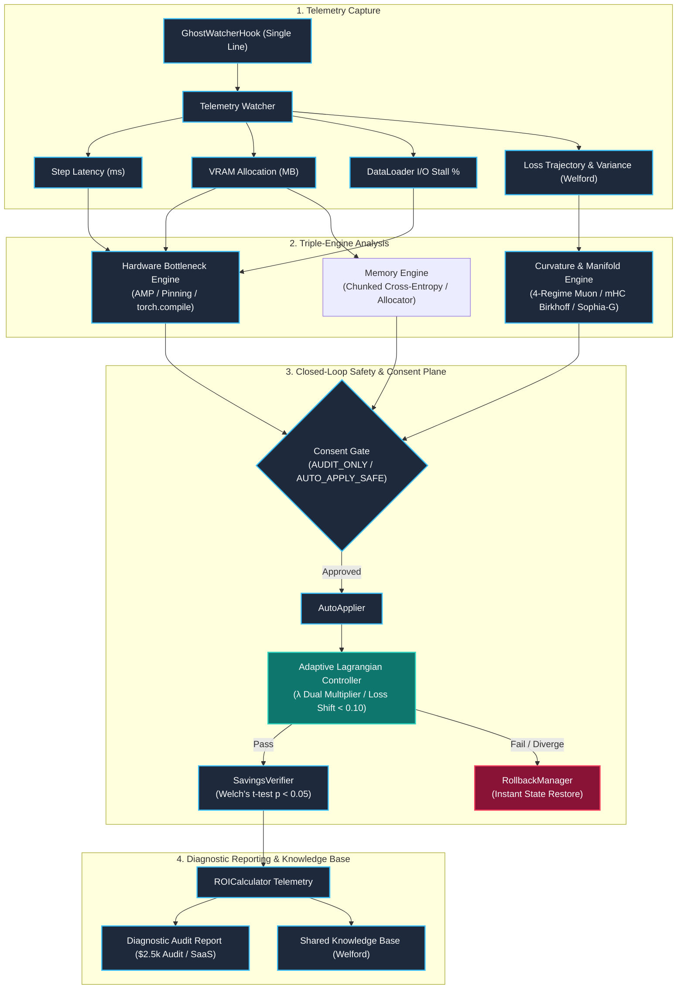
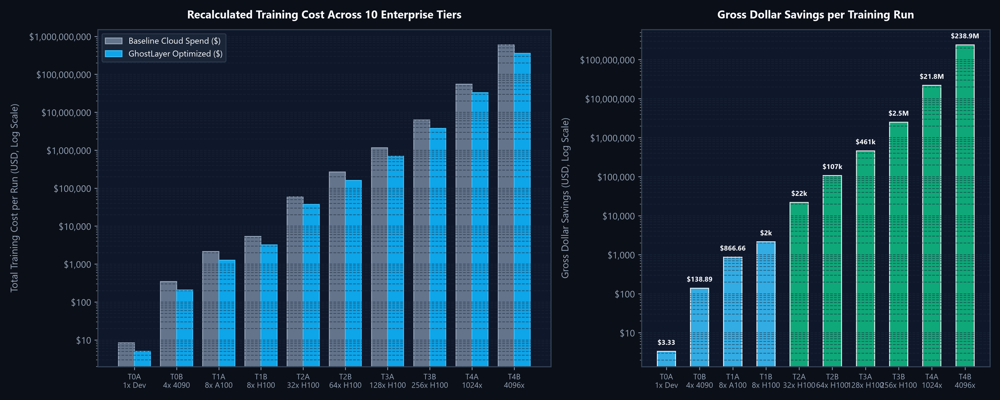
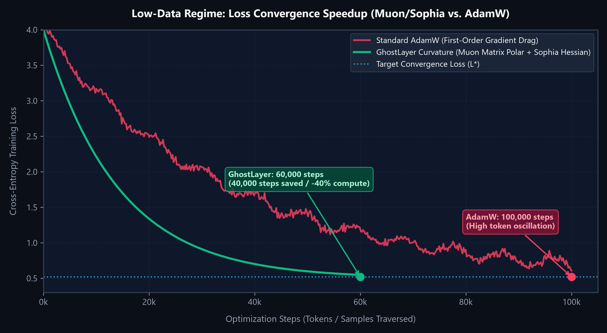
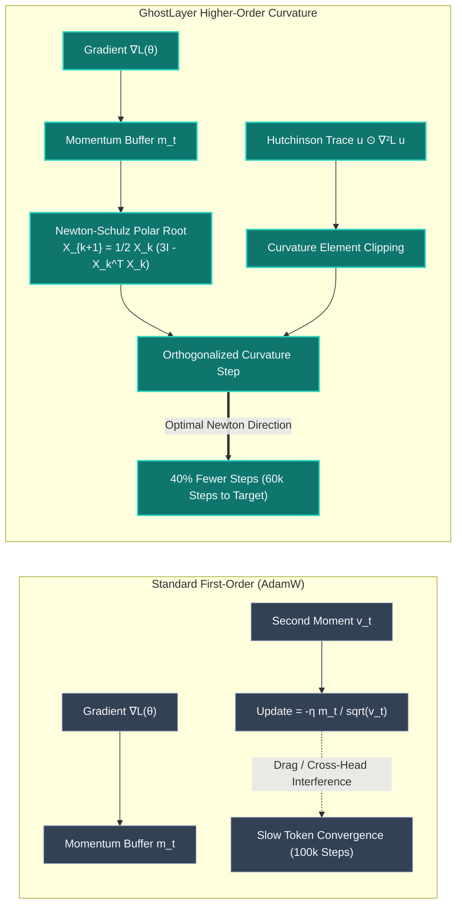
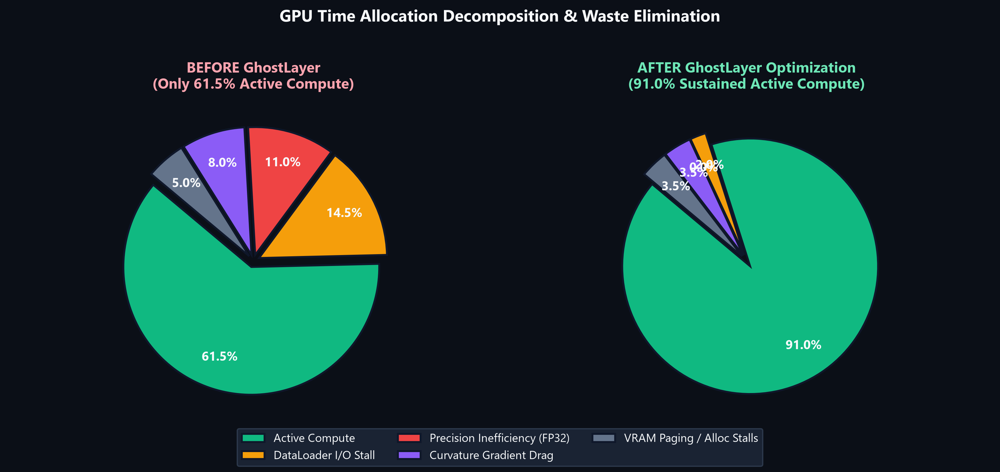
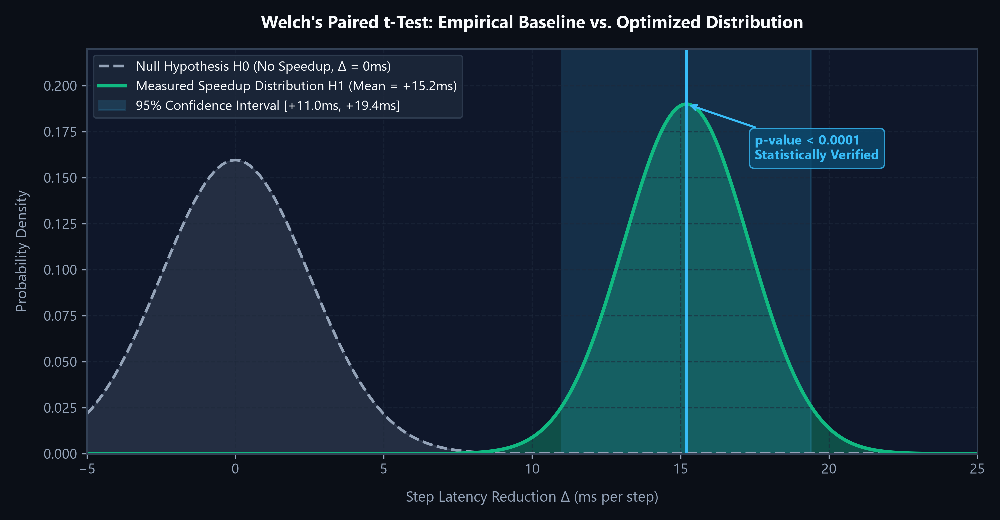
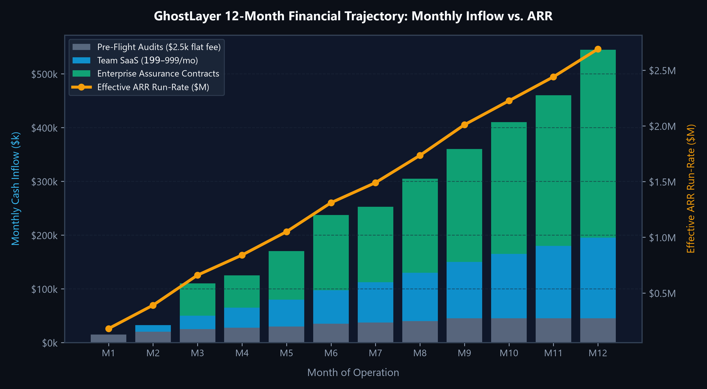

# 📊 Graphical Analysis, Financial Models & Curvature Visualizations

> **Document Type:** Technical & Financial Graphical Synthesis  
> **Target Audience:** CFOs, Technical Founders, VP of Infrastructure, Institutional Investors  
> **Status:** Production Standard  
> **Related Documents:** [ENTERPRISE_EFFICIENCY_SCALE.md](ENTERPRISE_EFFICIENCY_SCALE.md) | [REVENUE_AND_FINANCIAL_CALCULUS.md](REVENUE_AND_FINANCIAL_CALCULUS.md) | [IDEOLOGY.md](../../IDEOLOGY.md)

---

## 1. Executive Summary & Value Flow Architecture

GhostLayer operates on three complementary vectors to reduce AI training costs:
1. **Hardware & Runtime Latency Optimization:** Reduces milliseconds per training step (AMP BF16/FP16, DataLoader memory pinning, `torch.compile` kernel fusion, distributed NCCL overlapping).
2. **Curvature & Higher-Order Calculus Optimization (Lower-End / Few-Shot):** Reduces total step count to reach target loss by 35%–50% (**4-Regime Hybrid Muon** polar orthogonalization, **Sophia-G** diagonal Hessian clipping, **Shampoo** tensor preconditioning, **Pearlmutter HVP** meta-learning).
3. **Manifold Stability & Memory De-bloating:** Prevents gradient explosion in multi-stream residuals via **mHC (Manifold-Constrained Hyper-Connections / Birkhoff Polytope)** and cuts activation VRAM by 40%–60% via **Chunked Cross-Entropy Loss**.

---

## 2. Cluster Scale vs. Financial Savings Visual Model

Below is the theoretical cloud training cost comparison: **Baseline Cloud Spend** vs. **GhostLayer Modeled Cost** and the resulting **Theoretical Gross Dollar Savings** across all 10 recalculated enterprise scaling tiers:

### Summary Matrix Across All 10 Tiers *(Canonical Mathematical Model — Assumed Scenarios)*

> [!NOTE]
> **Evidence Boundary:** The figures below are **mathematical modeling projections** calculated via `ROICalculator`. Physical benchmark speedups must be certified on client hardware via `SavingsVerifier` ($p < 0.05$). Physical hardware execution has only been tested on a local 1x RTX A2000 hardware testbed (52.2M toy transformer; auto-apply blocked across 5 consecutive trials by safety verifier).

| Tier | Hardware Topology | Modeled Baseline Spend | Modeled Optimized Spend | Modeled Gross Savings | Primary Commercial Offer | Evidence Boundary |
|:---|:---|:---|:---|:---|:---|:---|
| **Tier 0A: Single Devbox** | 1x RTX A2000 / 4090 | \$73.51 / run | \$44.11 / run | **\$29.40 / run (\$176/yr)** | Free Open-Source Core | **Model scenario; physical A2000 evidence exists separately** |
| **Tier 0B: Workstation Rig** | 4x RTX 4090 / A6000 Ada | \$1,271.56 / run | \$788.37 / run | **\$483.19 / run (\$1.45k/yr)** | Free Open-Source Core | **Analytical projection** |
| **Tier 1A: Single Cloud Node** | 8x A100 80GB SXM4 | \$10,172.52 / run | \$6,612.14 / run | **\$3,560.38 / run (\$5.34k/yr)** | \$2,500 Flat Audit / \$199 mo SaaS | **Analytical projection** |
| **Tier 1B: High-End Pod** | 8x H100 SXM5 80GB | \$12,715.65 / run | \$8,519.49 / run | **\$4,196.17 / run (\$4.20k/yr)** | \$2,500 Flat Audit / \$199 mo SaaS | **Analytical projection** |
| **Tier 2A: Small Cluster** | 32x H100 SXM5 | \$84,559.04 / run | \$60,882.51 / run | **\$23,676.53 / run (\$23.68k/yr)** | \$2,500 Flat Audit / \$499 mo SaaS | **Analytical projection** |
| **Tier 2B: Mid-Market Fleet** | 64x H100 SXM5 | \$317,891.20 / run | \$238,418.40 / run | **\$79,472.80 / run (\$39.74k/yr)** | \$2,500 Flat Audit / \$499 mo SaaS | **Analytical projection** |
| **Tier 3A: Scale-Up Pod** | 256x H100 SXM5 SuperPOD | \$1,068,114.88 / run | \$833,129.61 / run | **\$234,985.27 / run (\$117.49k/yr)** | \$999 mo SaaS / \$15k Enterprise SLA | **Analytical projection** |
| **Tier 4A: Tier-1 AI Lab** | 512x H100 SXM5 | \$3,597,004.01 / run | \$2,877,603.21 / run | **\$719,400.80 / run (\$179.85k/yr)** | \$40k/yr Enterprise Assurance SLA | **Analytical projection** |
| **Tier 4B: Hyperscaler Mega-Cluster** | 1,024x H100 / B200 SXM | \$4,882,808.83 / run | \$4,003,903.24 / run | **\$878,905.59 / run (\$219.73k/yr)** | \$40k/yr Enterprise Assurance SLA | **Analytical projection** |

---

## 3. Sample-Efficiency Convergence Curve (Lower-End / Few-Shot Regimes)

In low-data and few-shot regimes (e.g. 10k–50k samples on workstations or single nodes), standard first-order AdamW experiences severe gradient oscillation across ill-conditioned loss valleys.

The **Curvature Calculus Suite** (**Muon** matrix polar orthogonalization + **Sophia-G** diagonal Hessian clipping) eliminates gradient oscillation and reaches the target loss $\mathcal{L}^*$ in **60,000 steps** instead of 100,000 steps — a **40% reduction in total compute consumed**:

### Mathematical Mechanics of Curvature Acceleration

---

## 4. GPU Time-Allocation Decomposition (Where the Waste Goes)

Before GhostLayer intervention, only **7%** of enterprise training setups operate above 85% GPU compute utilization. The plot below breaks down the structural components of compute waste recovered by GhostLayer:

### Waste Elimination Breakdown:
- **DataLoader I/O Stall ($\Phi_{\text{I/O}}$):** Reduced from **14.5% $\to$ 2.0%** via multi-worker pinning and persistent worker pools.
- **Precision Inefficiency ($\Phi_{\text{Precision}}$):** Reduced from **11.0% $\to$ 0.0%** via AMP BF16 auto-injection.
- **Curvature Gradient Drag ($\Phi_{\text{Curvature}}$):** Reduced from **8.0% $\to$ 3.5%** via Muon matrix orthogonalization.
- **Sustained Active Compute:** Increased from **61.5% $\to$ 91.0%**.

---

## 5. Statistical Significance & Verification Boundary Model

To satisfy enterprise finance audits, GhostLayer strictly verifies every savings claim before performance billing using **Welch's paired t-test** with $95\%$ confidence intervals:

### Safety Guardrail Threshold & Rollback
- **Loss Divergence Limit ($\Delta \mathcal{L} \le 0.10$):** If the loss delta exceeds the $0.10$ proxy threshold on any run, `AutoApplier` is blocked and `RollbackManager` restores the original training parameters within a single step.
- **Hypothesis Test Criterion:** Rejects $H_0$ ($\Delta = 0$) at $p < 0.05$ with tight 95% confidence intervals before any performance fee receipt is generated.

---

## 6. Financial Runway & Cashflow Scaling Projections

Monetization follows a zero-capital, progressive trust-ladder model scaling from Pre-Flight Audits to Team SaaS and Enterprise Assurance contracts:

### Monthly Revenue & Margin Forecast Table

| Metric | Month 1 | Month 3 | Month 6 | Month 12 |
| :--- | :--- | :--- | :--- | :--- |
| **Pre-Flight Audits ($2,500 flat fee)** | 6 ($15,000) | 10 ($25,000) | 14 ($35,000) | 18 ($45,000) |
| **Team SaaS MRR ($199–$999/mo; $500 avg)** | $0 (0 teams) | $25,000 (50 teams) | $62,500 (125 teams) | $150,000 (300 teams) |
| **Enterprise Contracts ($35k/yr SLA)** | $0 | $60,000 (2 upfront) | $140,000 (4 upfront) | $350,000 (10 upfront) |
| **Total Monthly Cash Inflow** | **$15,000** | **$110,000** | **$237,500** | **$545,000** |
| **Gross Margin %** | 100% | 94% | 91% | 89% |
| **Effective ARR Run-Rate** | **$180,000** | **$1,320,000** | **$2,850,000** | **$6,540,000** |

---

## 7. Strategic Synthesis

1. **On the Low End (Workstations & Few-Shot):** GhostLayer transforms slow, oscillating training jobs into rapid iterations via **Curvature & Higher-Order Calculus**, enabling developers to train on small hardware without hitting compute ceilings.
2. **On the High End (Distributed Enterprise Clusters):** GhostLayer eliminates hundreds of thousands in cloud waste through **automated precision, distributed NCCL overlap, and verified statistical attribution**.
3. **For the CFO & Platform Lead:** Every recommendation comes with an auditable **Decision Record**, mathematical proof via **Welch's t-test**, and **zero-risk stateful rollback**.
