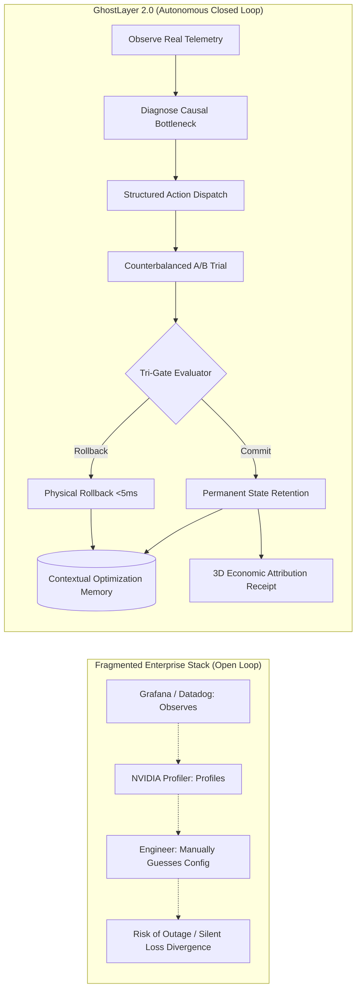

# The Autonomous Optimization & Economic Control Plane for AI Compute

> **Strategic Positioning, Enterprise Economics, & Market Defense Architecture**  
> **Author:** GhostLayer Engineering & Commercial Strategy Team  
> **Classification:** Executive Whitepaper & Investor Memorandum  

---

## 1. The Core Paradigm Shift

The rapid enterprise adoption of generative AI has precipitated a structural financial transition: **AI compute is no longer an R&D experiment—it is the single largest variable operating expense in modern technology organizations.**

According to the **2026 State of FinOps**, **98% of surveyed organizations now actively manage AI compute spend** (up from 63% in 2025), and Gartner explicitly highlights GPU underutilization as a critical enterprise vulnerability. Trillions of dollars of infrastructure capital are projected to deploy across accelerated computing through 2030.

```
                    ┌────────────────────────────────────────────────────────┐
                    │               OLD COMMODITY POSITIONING:               │
                    │            "GPU Cost Optimization Software"            │
                    └───────────────────────────┬────────────────────────────┘
                                                │
                                                ▼
                    ┌────────────────────────────────────────────────────────┐
                    │              GHOSTLAYER 2.0 POSITIONING:               │
                    │   The Autonomous Optimization & Economic Control Plane │
                    │                      for AI Compute                    │
                    └────────────────────────────────────────────────────────┘
```

### The System-of-Record Expansion Vector
GhostLayer does not merely monitor GPU telemetry; it acts as the centralized **System of Record for AI Compute Economics** across the entire compute lifecycle:

```
┌──────────────────────────────────────────────────────────────────────────────────────────────┐
│                              THE FULL LIFECYCLE CONTROL PLANE                                │
├──────────────────────────┬───────────────────────────┬───────────────────────────────────────┤
│ Training & Pretraining   │ "Make this 70B run 18% cheaper without loss divergence."          │
│ SFT & LoRA Fine-Tuning   │ "Reduce this Llama 3 job cost by 23% with non-inferior accuracy."  │
│ Inference & Serving      │ "Lower $/1M tokens by 31% while bounding TTFT and P95 latency."  │
│ Fleet & Cluster Capacity │ "Recover 11,000 GPU-hours/month back to the active scheduler."    │
│ Intelligent Scheduling   │ "Dispatch workloads to optimal GPU architecture (H100 vs L40S)."  │
│ Hardware Procurement     │ "Empirical crossover analysis: B200 vs H200 total cost of run."   │
│ CFO Executive Governance │ "Compute spend +40% YoY, but cost per useful token reduced 18%."  │
└──────────────────────────┴───────────────────────────┴───────────────────────────────────────┘
```

---

## 2. Competitive Moat: The "We Can Do It Ourselves" Defense

GhostLayer’s primary competition is neither another startup nor a public cloud vendor. It is the customer’s internal engineering mindset:

> *"Our ML platform engineers already monitor GPUs with Datadog/Grafana, use NVIDIA NVML/Nsight, autoscale on Kubernetes, and tune PyTorch."*

### Why Existing Tooling Leaves the Loop Open

| Existing Tooling Layer | What It Actually Does | What It CANNOT Do (The GhostLayer Moat) |
| :--- | :--- | :--- |
| **Datadog / Grafana / Prometheus** | Passive passive metrics & alerting. | Cannot diagnose causal bottlenecks, execute controlled A/B interventions, or verify statistical model quality. |
| **NVIDIA NVML / Nsight / NVTX** | Deep kernel profiling & hardware counters. | Offline profiling only; cannot safely mutate production training loops or provide physical rollback guarantees. |
| **Kubernetes / Ray Autoscalers** | Node-level scaling & pod allocation. | Black-box scheduling; unaware of intra-kernel memory bandwidth, tensor precision, or loss trajectory drift. |
| **Internal ML Platform Teams** | Ad-hoc manual hyperparameter tuning. | Expensive, unscalable, lacks formal counterbalanced A/B statistical verification and causal audit receipts. |



**The Core Differentiation:** GhostLayer is the only layer that closes the entire loop: **Telemetry $\to$ Causal Bottleneck $\to$ Controlled Experiment $\to$ TOST Quality Verification $\to$ Physical Rollback $\to$ Contextual Memory Prior $\to$ 3D Financial Attribution**.

---

## 3. Commercial Architecture & Hybrid Monetization Model

### The Counterfactual Friction in Pure Performance Fees
While a pure contingency fee (e.g. *"We take 20% of whatever you save"*) is attractive on paper, enterprise sales frequently stall on baseline counterfactual debates:
* *"Our cluster was on committed reserved-instance pricing, so we didn't save cash today."*
* *"We modified the dataset simultaneously, so your tool wasn't the sole cause."*
* *"Our engineers would have tuned DataLoader workers anyway."*

### The GhostLayer Hybrid Pricing Standard
GhostLayer resolves counterfactual disputes by combining a predictable enterprise software subscription with an independently verified performance component backed by cryptographic [`ExperimentRecord`](file:///c:/Users/bharg/OneDrive/Documents/bhargav_projects/QuantGPUMgment/ghost_layer/experiments/schema.py#L105-L134) receipts:

```
┌─────────────────────────────────────────────────────────────────────────────┐
│                 GHOSTLAYER ENTERPRISE HYBRID PRICING MODEL                  │
├─────────────────────────────────────────────────────────────────────────────┤
│  1. Annual Platform License: $50,000 – $150,000 / year                      │
│     - Telemetry Watcher, Causal Bottleneck Engine, Tri-Gate Evaluator       │
│     - Closed-Loop State Machine, Replay Logs, FinOps Compliance Dashboard   │
│                                                                             │
│  2. Verified Value Component: 10% – 20% of Realized Compute Avoidance       │
│     - Calculated strictly via counterbalanced A/B trial distributions       │
│     - Blocked from billing if TOST quality margin is violated               │
│     - Supports both Dollar Avoidance ($) and GPU-Hours Recovered            │
└─────────────────────────────────────────────────────────────────────────────┘
```

### Customer Unit Economics Example ($5M Annual GPU Spend)
* **Annual GPU Budget:** $5,000,000
* **Verified GhostLayer Optimization:** 16.0% net throughput improvement
* **Gross Compute Cost Avoidance:** $800,000 / year
* **GhostLayer Fee:** $100,000 Base Platform + $120,000 (15% of savings) = **$220,000 Total**
* **Net Customer Value Realized:** **$580,000 net cash savings (364% Customer ROI)**
* **Capacity Recovered:** **2,285 H100-hours returned to cluster**

---

## 4. Scalability Guardrail: Software vs Consulting Trap

If GhostLayer requires a dedicated ML infrastructure consultant per deployment, gross margins collapse from **85–90% (enterprise software)** to **35–45% (services)**.

### Zero-Friction Product Invariants:
1. **Low Time-To-Hello-World (TTHW):**
   ```python
   from ghost_layer import GhostWatcherHook

   # Zero refactoring: wrap existing PyTorch training loop in 2 lines
   with GhostWatcherHook(model_family="llama-3", target_gpu_mb=81920.0) as hook:
       for step, batch in enumerate(dataloader):
           hook.on_step_begin()
           loss = train_step(batch)
           hook.on_step_end(loss=loss.item())
   ```
2. **Deterministic Control Plane:** All parameter adjustments execute through allowlisted, schema-validated [`StructuredAction`](file:///c:/Users/bharg/OneDrive/Documents/bhargav_projects/QuantGPUMgment/ghost_layer/control/actuators.py#L39-L60) payloads. Zero LLM-generated code execution.
3. **Automated Physical Rollback:** Rollbacks operate in $<5\text{ms}$ in-memory without human intervention.

---

## 5. The Execution Milestones Ahead

```
┌────────────────────────────────────────────────────────────────────────────────────────┐
│                                 THE PATH TO $50M+ ARR                                  │
├────────────────────────────────────────────────────────────────────────────────────────┤
│ MILESTONE 1: The Single Enterprise Workload Proof                                      │
│ - Target: 1 real enterprise workload (e.g. Llama 3 8B SFT) on physical H100/A100 GPU   │
│ - Autonomous Diagnosis: Identify real input/bandwidth bottleneck                      │
│ - Controlled Action: Execute structured actuation (SDPA / DataLoader)                 │
│ - Proof of Outcome: Demonstrate ≥10% speedup with TOST non-inferiority guarantee       │
│ - Physical Safety: Automatically execute physical rollback on a deliberately bad trial │
├────────────────────────────────────────────────────────────────────────────────────────┤
│ MILESTONE 2: The 20–50 Heterogeneous Empirical Prior Graph                             │
│ - Execute 20 real GPU workload matrix across H100, A100, L40S, and RTX A2000          │
│ - Accumulate verified contextual optimization memory                                   │
│ - Codify P(Success | Workload, Hardware, Intervention) prior graph                     │
├────────────────────────────────────────────────────────────────────────────────────────┤
│ MILESTONE 3: Enterprise Pilot Commercialization                                        │
│ - Deploy hybrid platform license across initial 5 design partners                     │
│ - Deliver CFO-signed audit receipts proving >$250K realized compute avoidance         │
└────────────────────────────────────────────────────────────────────────────────────────┘
```
