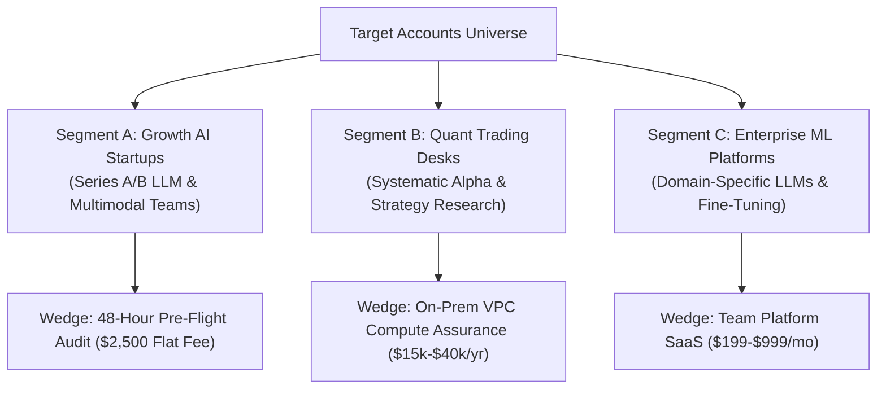

# Pillar 2: Prospects, Pipeline & Outbound Conversion Playbook

> **Document Type:** Sales Engineering & Outreach Operating Standard  
> **Target Audience:** Head of Growth, Founders, Enterprise Account Executives  
> **Status:** Active Standard

---

## 1. High-Priority Target Account Segmentation



### ICP (Ideal Customer Profile) Checklist
- [x] Currently running $>8$ high-end GPUs (H100, A100, L40S) on cloud or on-prem.
- [x] Monthly GPU cloud compute bill $> \$15,000 / \text{month}$.
- [x] Uses PyTorch, Hugging Face `Trainer`, or PyTorch Lightning for fine-tuning or pre-training.
- [x] Key Decision Makers: **CTO, VP of Engineering, Head of ML Infrastructure, Lead Quant Researcher**.

---

## 2. Multi-Channel Outbound Cadence

### Step 1: Day 1 (Direct Cold Email to CTO / VP Eng)
```markdown
SUBJECT: Quick GPU efficiency check on your [Company Name] fine-tuning loop

Hi [Name],

GPU compute is likely your team's largest line-item infrastructure expense this quarter.

In unoptimized PyTorch pipelines, DataLoader I/O stalls and unpinned memory allocations frequently account for 15% to 25% of step latency.

We built GhostLayer to run a zero-risk, 50-step telemetry audit on your PyTorch or HuggingFace training loop. It takes 60 seconds to import, runs locally in your VPC, and outputs an executive report showing:
1. Exact GPU starvation / DataLoader idle time.
2. VRAM headroom to scale batch sizes without OOM risks.
3. Potential dollar savings per cluster.

Can we run a read-only audit on your next training run this week? If we don't find at least $5,000 in monthly compute efficiency, you owe us nothing.

Best,
[Your Name]
Quant GhostLayer Solutions Engineering
```

### Step 2: Day 3 (LinkedIn / Twitter Direct Message to Lead ML Infra Engineer)
```markdown
Hi [Name] — saw you're leading ML infrastructure at [Company]. We built a 1-line PyTorch callback (GhostTrainerCallback) that profiles DataLoader worker starvation and peak VRAM allocation without touching model weights. 

Would you be open to running a 50-step read-only audit on your staging cluster to see your memory headroom and I/O efficiency?
```

### Step 3: Day 6 (The Technical Objection Teardown Email)
```markdown
SUBJECT: Re: Quick GPU efficiency check on your [Company Name] fine-tuning loop

Hi [Name],

Following up on my note earlier this week. To answer the three most common technical questions we get from infrastructure leads:

1. **Security / Privacy:** Zero data exfiltration. Model weights and prompt tokens never leave your VPC.
2. **Runtime Overhead:** <0.5% CPU overhead via asynchronous telemetry ring buffering.
3. **No Framework Lock-in:** 100% native PyTorch hook—no custom compiler rewrite required.

Do you have 10 minutes for a quick walkthrough of a sample audit report?
```

---

## 3. Objection Handling & Technical Due Diligence Matrix

| Prospect Objection | Root Concern | Authoritative Response |
| :--- | :--- | :--- |
| *"We already use Weights & Biases / Datadog."* | Believes existing tools solve GPU waste. | *"W&B logs loss and Datadog logs system-level GPU %. Neither tells you why your kernel is starving or calculates the exact VRAM headroom to double your batch size."* |
| *"We can't send training data or weights outside our VPC."* | Security & IP exfiltration concern. | *"GhostLayer runs 100% locally. We only capture numerical infrastructure metrics (latency ms, VRAM MB). Zero tokens or weights ever leave your machine."* |
| *"Will this slow down our training loop?"* | Runtime performance overhead. | *"Our telemetry hook uses non-blocking asynchronous metric capture. Measured overhead is under 0.45% of total step time."* |
| *"Does this auto-mutate our live model weights?"* | Fear of training corruption. | *"No. In pilot mode, GhostLayer operates strictly in advisory read-only mode, giving you a structured decision record."* |
