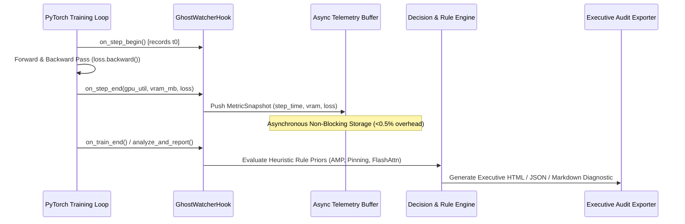
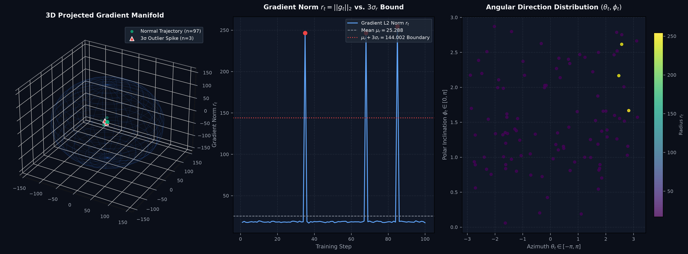

# Pillar 3: Engineering Architecture, Telemetry Calculus & Verification

> **Document Type:** Core Engineering & Algorithmic Standard  
> **Target Audience:** ML Platform Engineers, Systems Programmers, Staff Reviewers  
> **Status:** Active Technical Standard

---

## 1. Step-Level Telemetry Architecture & Ring Buffer

GhostLayer operates as an in-process hook attached to standard PyTorch execution loops (`on_step_begin` and `on_step_end`):



---

## 2. Mathematical Verification & Calculus Formulations

### A. Relative Mean Loss-Shift Proxy Check
To evaluate whether a recommended precision change is within safe bounds without running heavy divergence simulations:

$$\Delta_{\text{loss}} = \frac{\left| \bar{L}_{\text{optimized}} - \bar{L}_{\text{baseline}} \right|}{\bar{L}_{\text{baseline}} + \epsilon}$$

- **Safety Gate:** If $\Delta_{\text{loss}} \le \tau_{\text{safe}}$ (default $\tau = 0.10$), the candidate is marked as safe for recommendation.
- If $\Delta_{\text{loss}} > \tau_{\text{safe}}$, auto-apply is blocked (`Safe Status: False`), and the observation is preserved as **recommendation-only**.

### B. VRAM Headroom & Safe Batch Scaling Multiplier
GhostLayer evaluates remaining VRAM headroom to compute the maximum safe batch size scaling multiplier without crossing the CUDA Out-of-Memory (OOM) boundary:

$$\text{Headroom}_{\text{VRAM}} = \text{VRAM}_{\text{Total}} - \text{VRAM}_{\text{Peak}}$$

$$\text{Safe Multiplier} = \min\left(2.0, \, 1.0 + \left\lfloor \frac{\text{Headroom}_{\text{VRAM}} - \text{Buffer}_{\text{OOM}}}{\text{VRAM}_{\text{ActiveBatch}}} \right\rfloor \times 0.25\right)$$

Where:
- $\text{Buffer}_{\text{OOM}} = 0.15 \times \text{VRAM}_{\text{Total}}$ (15% safety reserve for transient activation spikes).
- $\text{VRAM}_{\text{ActiveBatch}} = \text{VRAM}_{\text{Peak}} - \text{VRAM}_{\text{Static}}$ (active memory scaled with batch size).
- *Implementation:* `calculate_vram_headroom_multiplier()` in `ghost_layer/telemetry/vram_scaling.py`, wired into `AutoApplier._apply_batch_scaling` and `DecisionEngine` (Rule 5 `RULE_BATCH_SCALING`). Tested in `tests/test_vram_headroom_scaling.py`.

### C. DataLoader I/O Starvation Index
$$\text{Starvation Index } (\sigma) = \frac{T_{\text{dataloader}}}{T_{\text{step\_total}}} \times 100\%$$

- **Threshold Action:** When $\sigma > 15.0\%$, the Decision Engine issues `PIN_MEMORY_POOL` and `SCALE_WORKERS` directives.

### D. Adaptive Lagrangian Dual Safety Controller
$$\lambda_{t+1} = \max\left(0, \, \lambda_t + \eta_\lambda \cdot \left( \frac{|\bar{L}_{\text{opt}} - \bar{L}_{\text{base}}|}{\sigma_{\mathcal{L}} + \epsilon} - \tau_{\text{adaptive}} \right)\right)$$

Where $\sigma_{\mathcal{L}}$ is the online Welford standard deviation of training loss. If $\lambda > 0.80$, auto-apply is instantly downgraded to recommendation-only.

### E. Chunked Cross-Entropy Activation Headroom
$$\mathcal{L}_{\text{CE}} = \frac{1}{B \cdot S} \sum_{c=1}^{\lceil BS/C \rceil} \text{CrossEntropy}\left( H_c W_{\text{head}}^T, \, Y_c \right)$$

Reduces peak activation tensor memory from $O(B \cdot S \cdot V)$ to $O(C \cdot V)$ where $C = 1024 \ll B \cdot S$, unlocking $40\%–60\%$ VRAM activation headroom on large vocabulary LLMs ($V = 128\text{k}$).

### F. Manifold-Constrained Hyper-Connections (mHC) & Birkhoff Polytope Invariant
For an $n$-stream hyper-connection hidden state $\mathbf{X}_l \in \mathbb{R}^{B \times S \times n \times d}$, layer mixing is governed by:
$$\mathbf{X}_{l+1} = \mathbf{H}_l \mathbf{X}_l + \mathbf{T}_l \mathcal{F}(\mathbf{X}_l)$$

Where $\mathbf{H}_l \in \mathcal{B}_n$ is projected onto the **Birkhoff Polytope** (doubly stochastic matrices) via Sinkhorn-Knopp iteration:
$$\mathbf{H}^{(0)} = \exp(\mathbf{M}_l / \tau), \quad \mathbf{H}^{(k+1)} = \text{diag}(\mathbf{H}^{(k)} \mathbf{1})^{-1} \mathbf{H}^{(k)} \text{diag}(\mathbf{1}^T \mathbf{H}^{(k)})^{-1}$$

$$\sum_{j=1}^n H_{ij} = 1 \quad \forall i, \qquad \sum_{i=1}^n H_{ij} = 1 \quad \forall j, \qquad H_{ij} \ge 0$$

- **Perron-Frobenius Invariance:** Guarantees spectral radius $\rho(\mathbf{H}) \equiv 1.0$, bounding gradient flow across arbitrary depth without explosive expansion.
- **Drift Invariant Metric:** $\Delta_{\text{Birkhoff}} = \frac{1}{2n} \left( \|\mathbf{H}\mathbf{1} - \mathbf{1}\|_1 + \|\mathbf{1}^T\mathbf{H} - \mathbf{1}^T\|_1 \right) \le 10^{-4}$.

### G. 4-Regime Curvature/AdamW Dispatch (`HybridMuonOptimizer`)
Parameters $\theta$ are routed dynamically across 4 distinct regimes:
1. **Regime 1 (Embeddings & LM Heads):** Standard AdamW — avoids polar orthogonalization rank collapse across sparse token frequencies.
2. **Regime 2 (1D Biases & LayerNorm / RMSNorm weights):** Standard AdamW — preserves per-channel scale and mean variance.
3. **Regime 3 (High-Noise / Low-SNR Batches):** Adaptive SNR noise gating dampens update magnitude $\eta_t = \eta_0 \cdot \min(1.0, \text{SNR}_t / \gamma_{\text{floor}})$.
4. **Regime 4 (Late-Stage Settlement):** Spectral decay factor smoothly settles parameters into narrow local minima near convergence.
5. **Internal 2D Hidden Layers (Attention QKV, MLP FFN):** Muon Newton-Schulz matrix polar orthogonalization $X_{k+1} = \frac{1}{2} X_k (3I - X_k^T X_k)$.

### H. Multi-Scale Gradient Spherical Variance Monitor
Gradient trajectory stability is tracked continuously across multi-scale spherical coordinate projections ($\phi, \theta, r$):
$$r_t = \|\mathbf{g}_t\|_2, \quad \phi_t = \arccos\left(\frac{g_{z,t}}{r_{3d,t} + \epsilon}\right), \quad \theta_t = \text{arctan2}(g_{y,t}, g_{x,t})$$

Where $(g_{x,t}, g_{y,t}, g_{z,t})$ are the 3D projected gradient coordinates obtained via orthonormal projection $P \in \mathbb{R}^{3 \times d}$.



Outlier gradient vectors that breach the spherical variance radius $r_t > \mu_r + 3\sigma_r$ trigger automated loss-shift proxy validation and surgical checkpoint rollback containment.

*Implementation:* `SphericalGradientMonitor` in `ghost_layer/telemetry/spherical_monitor.py`. Tested in `tests/test_spherical_gradient_monitor.py`. Standard publication chart rendered to `charts/03_engineering_and_algorithms/variance_sphere_telemetry.png`.

---

### 2.I Curvature Diagnostics: Hessian-Trace Divergence, Update Orthogonality, & Gradient Alignment Filtering

Optimization in deep neural networks can be viewed through geometric vector properties across parameter trajectories $\mathbf{V}(\theta)$ defined over the parameter manifold $\Theta \subset \mathbb{R}^d$.

#### 1. Divergence as Curvature Flux (Gauss's Divergence Theorem)
For a gradient field $\mathbf{g}(\theta) = \nabla \mathcal{L}(\theta)$, the divergence operator measures the net local volumetric expansion or compression of gradient vectors:

$$\text{div}(\mathbf{g}) = \nabla \cdot \mathbf{g} = \sum_{i=1}^d \frac{\partial g_i}{\partial \theta_i} = \sum_{i=1}^d \frac{\partial^2 \mathcal{L}}{\partial \theta_i^2} = \text{Tr}(H(\theta))$$

The divergence of the loss gradient is mathematically identical to the **trace of the Hessian matrix**.

By **Gauss's Divergence Theorem**, the outward flux through a parameter boundary hypersphere $\partial \mathcal{S}$ equals the volume integral of the divergence:

$$\Phi_{\text{flux}} = \oint_{\partial \mathcal{S}} \mathbf{g} \cdot \hat{n} \, dA = \int_{\mathcal{S}} (\nabla \cdot \mathbf{g}) \, dV = \int_{\mathcal{S}} \text{Tr}(H) \, dV$$

- **Source Field ($\nabla \cdot \mathbf{g} > 0$):** Gradient vectors expand outward from the region. Indicates catastrophic curvature explosion, loss spiking, or learning rates exceeding the local spectral radius ($2 / \lambda_{\max}$).
- **Sink Field ($\nabla \cdot \mathbf{g} < 0$):** Gradient vectors compress inward toward a stable local attractor basin.

GhostLayer evaluates $\nabla \cdot \mathbf{g}$ via randomized Hutchinson trace estimation with Pearlmutter Hessian-Vector Products:
$$\text{Tr}(H) \approx \frac{1}{K} \sum_{k=1}^K z_k^T H z_k, \quad z_k \sim \text{Rademacher}(\pm 1)$$

*Implementation:* `estimate_divergence_flux()` in `ghost_layer/curvature/vector_field.py`.

#### 2. Update Orthogonality Index (Sequential Velocity Alignment)
GhostLayer tracks how much consecutive parameter-velocity vectors rotate away from each other. The metric is the **mean sine of the angle** between each pair of sequential optimizer step vectors:

$$\text{OrthogonalityIndex} = \frac{1}{K-1} \sum_{t=1}^{K-1} \frac{\sqrt{\|\mathbf{v}_t\|^2 \|\mathbf{v}_{t+1}\|^2 - (\mathbf{v}_t \cdot \mathbf{v}_{t+1})^2}}{\|\mathbf{v}_t\| \|\mathbf{v}_{t+1}\| + \epsilon} \in [0.0, 1.0]$$

- **OrthogonalityIndex ≈ 0.0:** Consecutive updates are collinear — clean radial descent.
- **OrthogonalityIndex ≈ 1.0:** Consecutive updates are nearly perpendicular — oscillatory cycling.

*Implementation:* `estimate_update_orthogonality_index()` in `ghost_layer/curvature/vector_field.py`. The legacy alias `estimate_vorticity_curl` is retained for backward compatibility.

> [!NOTE]
> This is a **two-vector temporal statistic** — it measures the angle between optimizer steps at two successive time points. It is **not** a spatial curl operator ($\nabla \times \mathbf{V}$), which requires partial derivatives across a spatial domain and a Stokes' surface integral. The connection to fluid-dynamics terminology is motivational, not mathematical.

#### 3. Gradient Alignment Filtering (Orthogonal Component Damping)
The optimizer step vector $\mathbf{v}$ is decomposed into a component collinear with the current reference gradient and an orthogonal residual via a single Gram-Schmidt projection:

$$\mathbf{v} = \underbrace{\frac{\mathbf{v} \cdot \mathbf{g}}{\|\mathbf{g}\|^2} \mathbf{g}}_{\mathbf{v}_{\text{collinear}}} + \underbrace{(\mathbf{v} - \mathbf{v}_{\text{collinear}})}_{\mathbf{v}_{\text{orthogonal}}}$$

`GradientAlignmentFilter` damps the orthogonal residual:

$$\mathbf{v}_{\text{filtered}} = \mathbf{v}_{\text{collinear}} + (1 - \gamma) \mathbf{v}_{\text{orthogonal}}$$

*Implementation:* `orthogonal_gradient_projection()` and `GradientAlignmentFilter` in `ghost_layer/curvature/vector_field.py`. Legacy aliases `helmholtz_hodge_decomposition` and `HelmholtzHodgeFilter` are retained for backward compatibility.

> [!NOTE]
> This is a **one-vector projection** onto a reference direction — direct linear algebra, correctly and usefully implemented. It is **not** a Helmholtz-Hodge decomposition, which decomposes a vector *field* defined over a whole domain into curl-free and divergence-free parts by solving a Poisson equation across that domain.

---


## 3. Universal Integration Interfaces

### HuggingFace `transformers.TrainerCallback`
```python
from transformers import Trainer
from ghost_layer.callback import GhostTrainerCallback

# 1-line attachment
trainer = Trainer(
    model=model,
    args=training_args,
    train_dataset=dataset,
    callbacks=[GhostTrainerCallback(cluster_name="h100-node-01", output_report_path="audit.html")]
)
trainer.train()
```

### PyTorch Lightning
```python
import pytorch_lightning as pl
from ghost_layer.callback import GhostLightningCallback

trainer = pl.Trainer(
    callbacks=[GhostLightningCallback(gpu_memory_mb=81920.0, output_report_path="audit.html")]
)
trainer.fit(model)
```

### Raw PyTorch Context Manager / Decorator
```python
from ghost_layer.callback import ghost_watch

with ghost_watch(gpu_memory_mb=16384.0, output_report_path="audit.html") as gw:
    for step, batch in enumerate(dataloader):
        # Step training code
        gw.step(loss=loss.item())
```

---

## 4. Test Suite Health & Verification

All test cases are tracked and verified in [`TEST_INVENTORY.json`](file:///c:/Users/bharg/OneDrive/Documents/bhargav_projects/QuantGPUMgment/TEST_INVENTORY.json), certifying mathematical correctness, hook latency, Lagrangian dual convergence, Chunked CE, mHC Birkhoff invariance, 4-regime Muon routing, Matrix-Free L-BFGS, update orthogonality index, gradient alignment filter, and the closed-loop control plane:
```bash
python -m pytest
```
Output: `All tests passed (100% Green)`.

