# Quant Ghost Layer: AI Training Efficiency & ROI Audit Report
**Client:** Client AI Research Lab  
**Target Hardware:** NVIDIA Cluster (16GB VRAM per GPU)  
**Status:** SIMULATED / DEMO DATA  

> [!WARNING]
> **SIMULATED/DEMO RUN**: This report was generated from synthetic benchmark data, not actual client telemetry. Do not present as verified results.

---

## 1. Executive Summary & Financial Receipts

| Metric | Baseline | Ghost Layer Optimized | Savings / Value |
|---|---|---|---|
| **Step Throughput Time** | `240.0 ms` | `132.0 ms` | **+45.0% Speedup** |
| **Total GPU Hours Needed** | `0.64 hrs` | `0.35 hrs` | **0.29 GPU-Hours Saved** |
| **Total Compute Cost ($)** | `$2.24` | `$1.23` | **$1.01 Gross Savings** |
| **Net Client Dollar Savings** | - | - | **$0.76 Net Saved** |
| **Performance Fee (25%)** | - | - | **$0.25 Earned** |

> [!NOTE]
> Performance Fee is calculated strictly as 25% of verified GPU compute savings ($1.01). Zero cost is incurred if no efficiency gain is achieved.

---

## 2. Telemetry Baseline Diagnostics

- **Total Training Steps Observed:** `100`
- **Average GPU Compute Utilization:** `42.0%`
- **Peak VRAM Memory Allocation:** `7200.0 MB` / `16384.0 MB`
- **DataLoader I/O Stall Percentage:** `20.8%`
- **Active Precision Standard:** `FP32`
- **Gradient Checkpointing Enabled:** `No`
- **FlashAttention Active:** `No`

---

## 3. High-Value Optimization Recommendations


### 1. Enable BF16 / FP16 Mixed Precision Training (`RULE_MIXED_PRECISION`)
- **Impact Level:** `HIGH` | **Est. Speedup:** `~45% (Typical Published Range)`
- **Auto-apply Safe:** `No (Requires Manual Review)`
- **Description:** Training in standard FP32 precision underutilizes Tensor Cores. Switching to Automatic Mixed Precision (AMP) with BF16/FP16 yields up to 2x-4x throughput with negligible accuracy impact.
- **Actionable Fix:**
```python
from torch.cuda.amp import autocast
# Wrap forward pass:
with autocast(dtype=torch.bfloat16):
    outputs = model(inputs)

```

### 2. Optimize PyTorch DataLoader Workers & Memory Pinning (`RULE_DATALOADER_WORKERS`)
- **Impact Level:** `HIGH` | **Est. Speedup:** `~25% (Typical Published Range)`
- **Auto-apply Safe:** `No (Requires Manual Review)`
- **Description:** DataLoader is currently causing a 20.8% I/O stall on the GPU because num_workers=0 and pin_memory=False.
- **Actionable Fix:**
```python
DataLoader(dataset, batch_size=32, num_workers=4, pin_memory=True, persistent_workers=True)
```

### 3. Enable FlashAttention-2 Kernel (`RULE_FLASH_ATTENTION`)
- **Impact Level:** `HIGH` | **Est. Speedup:** `~35% (Typical Published Range)`
- **Auto-apply Safe:** `No (Requires Manual Review)`
- **Description:** Standard PyTorch attention computes full NxN attention matrices in RAM. FlashAttention computes attention in GPU SRAM, dramatically cutting memory footprint and boosting step throughput.
- **Actionable Fix:**
```python
model = AutoModelForCausalLM.from_pretrained(model_id, torch_dtype=torch.bfloat16, attn_implementation='flash_attention_2')
```

### 4. Increase Batch Size / Gradient Accumulation Steps (`RULE_BATCH_SCALING`)
- **Impact Level:** `MEDIUM` | **Est. Speedup:** `~30% (Typical Published Range)`
- **Auto-apply Safe:** `No (Requires Manual Review)`
- **Description:** GPU peak memory usage is only 43.9% and utilization is 42.0%. Increasing micro-batch size saturates CUDA cores.
- **Actionable Fix:**
```python
# Double micro-batch size or set gradient_accumulation_steps = 2/4
```

### 5. Apply Graphify Operator Fusion (`torch.compile` Inductor Backend) (`RULE_GRAPHIFY_TORCH_COMPILE`)
- **Impact Level:** `HIGH` | **Est. Speedup:** `~11.9% (Measured/Estimated from Graphify)`
- **Auto-apply Safe:** `No (Requires Manual Review)`
- **Description:** Graphify execution graph mapping identified 25 fusible elementwise RMSNorm & Activation subgraphs. Compiling the DAG fuses GPU kernels, eliminating intermediate VRAM roundtrips.
- **Actionable Fix:**
```python
model = torch.compile(model, mode='reduce-overhead', backend='inductor')
```


---

## 3.5. Graphify Computational DAG Analysis & Operator Fusion Topology

- **Total Execution Nodes:** `38`
- **Tensor Transfer Edges:** `37`
- **True Critical Path Latency:** `415.2 ms`
- **Fusible Operator Subgraphs Identified:** `25` operators across `12` clusters
- **Estimated Fusion Latency Reduction:** `+11.9%`
- **Peak VRAM Memory Bottleneck Node:** `layer_0_attention` (`1200.0 MB`)
- **Torch Compile (`inductor`) Recommended:** `Yes`

```mermaid
flowchart TD
    %% Graphify DAG for AuditedModel
    embedding["Token & Positional Embedding<br/>2.5ms | 256MB"]:::critical
    layer_0_attention["Layer 0 Multi-Head Self-Attention<br/>18.5ms | 1200MB"]:::critical
    layer_0_mlp["Layer 0 MLP / SwiGLU FeedForward<br/>12.0ms | 800MB"]:::critical
    layer_0_norm["Layer 0 RMSNorm & Residual<br/>1.5ms | 64MB"]:::critical
    layer_1_attention["Layer 1 Multi-Head Self-Attention<br/>18.5ms | 1200MB"]:::critical
    layer_1_mlp["Layer 1 MLP / SwiGLU FeedForward<br/>12.0ms | 800MB"]:::critical
    layer_1_norm["Layer 1 RMSNorm & Residual<br/>1.5ms | 64MB"]:::critical
    layer_2_attention["Layer 2 Multi-Head Self-Attention<br/>18.5ms | 1200MB"]:::critical
    layer_2_mlp["Layer 2 MLP / SwiGLU FeedForward<br/>12.0ms | 800MB"]:::critical
    layer_2_norm["Layer 2 RMSNorm & Residual<br/>1.5ms | 64MB"]:::critical
    layer_3_attention["Layer 3 Multi-Head Self-Attention<br/>18.5ms | 1200MB"]:::critical
    layer_3_mlp["Layer 3 MLP / SwiGLU FeedForward<br/>12.0ms | 800MB"]:::critical
    layer_3_norm["Layer 3 RMSNorm & Residual<br/>1.5ms | 64MB"]:::critical
    layer_4_attention["Layer 4 Multi-Head Self-Attention<br/>18.5ms | 1200MB"]:::critical
    layer_4_mlp["Layer 4 MLP / SwiGLU FeedForward<br/>12.0ms | 800MB"]:::critical
    layer_4_norm["Layer 4 RMSNorm & Residual<br/>1.5ms | 64MB"]:::critical
    layer_5_attention["Layer 5 Multi-Head Self-Attention<br/>18.5ms | 1200MB"]:::critical
    layer_5_mlp["Layer 5 MLP / SwiGLU FeedForward<br/>12.0ms | 800MB"]:::critical
    layer_5_norm["Layer 5 RMSNorm & Residual<br/>1.5ms | 64MB"]:::critical
    layer_6_attention["Layer 6 Multi-Head Self-Attention<br/>18.5ms | 1200MB"]:::critical
    layer_6_mlp["Layer 6 MLP / SwiGLU FeedForward<br/>12.0ms | 800MB"]:::critical
    layer_6_norm["Layer 6 RMSNorm & Residual<br/>1.5ms | 64MB"]:::critical
    layer_7_attention["Layer 7 Multi-Head Self-Attention<br/>18.5ms | 1200MB"]:::critical
    layer_7_mlp["Layer 7 MLP / SwiGLU FeedForward<br/>12.0ms | 800MB"]:::critical
    layer_7_norm["Layer 7 RMSNorm & Residual<br/>1.5ms | 64MB"]:::critical
    layer_8_attention["Layer 8 Multi-Head Self-Attention<br/>18.5ms | 1200MB"]:::critical
    layer_8_mlp["Layer 8 MLP / SwiGLU FeedForward<br/>12.0ms | 800MB"]:::critical
    layer_8_norm["Layer 8 RMSNorm & Residual<br/>1.5ms | 64MB"]:::critical
    layer_9_attention["Layer 9 Multi-Head Self-Attention<br/>18.5ms | 1200MB"]:::critical
    layer_9_mlp["Layer 9 MLP / SwiGLU FeedForward<br/>12.0ms | 800MB"]:::critical
    layer_9_norm["Layer 9 RMSNorm & Residual<br/>1.5ms | 64MB"]:::critical
    layer_10_attention["Layer 10 Multi-Head Self-Attention<br/>18.5ms | 1200MB"]:::critical
    layer_10_mlp["Layer 10 MLP / SwiGLU FeedForward<br/>12.0ms | 800MB"]:::critical
    layer_10_norm["Layer 10 RMSNorm & Residual<br/>1.5ms | 64MB"]:::critical
    layer_11_attention["Layer 11 Multi-Head Self-Attention<br/>18.5ms | 1200MB"]:::critical
    layer_11_mlp["Layer 11 MLP / SwiGLU FeedForward<br/>12.0ms | 800MB"]:::critical
    layer_11_norm["Layer 11 RMSNorm & Residual<br/>1.5ms | 64MB"]:::critical
    head["LM Head Logits Projection<br/>5.0ms | 512MB"]:::critical
    embedding -->|"64MB"| layer_0_attention
    layer_0_attention -->|"64MB"| layer_0_mlp
    layer_0_mlp -->|"64MB"| layer_0_norm
    layer_0_norm -->|"64MB"| layer_1_attention
    layer_1_attention -->|"64MB"| layer_1_mlp
    layer_1_mlp -->|"64MB"| layer_1_norm
    layer_1_norm -->|"64MB"| layer_2_attention
    layer_2_attention -->|"64MB"| layer_2_mlp
    layer_2_mlp -->|"64MB"| layer_2_norm
    layer_2_norm -->|"64MB"| layer_3_attention
    layer_3_attention -->|"64MB"| layer_3_mlp
    layer_3_mlp -->|"64MB"| layer_3_norm
    layer_3_norm -->|"64MB"| layer_4_attention
    layer_4_attention -->|"64MB"| layer_4_mlp
    layer_4_mlp -->|"64MB"| layer_4_norm
    layer_4_norm -->|"64MB"| layer_5_attention
    layer_5_attention -->|"64MB"| layer_5_mlp
    layer_5_mlp -->|"64MB"| layer_5_norm
    layer_5_norm -->|"64MB"| layer_6_attention
    layer_6_attention -->|"64MB"| layer_6_mlp
    layer_6_mlp -->|"64MB"| layer_6_norm
    layer_6_norm -->|"64MB"| layer_7_attention
    layer_7_attention -->|"64MB"| layer_7_mlp
    layer_7_mlp -->|"64MB"| layer_7_norm
    layer_7_norm -->|"64MB"| layer_8_attention
    layer_8_attention -->|"64MB"| layer_8_mlp
    layer_8_mlp -->|"64MB"| layer_8_norm
    layer_8_norm -->|"64MB"| layer_9_attention
    layer_9_attention -->|"64MB"| layer_9_mlp
    layer_9_mlp -->|"64MB"| layer_9_norm
    layer_9_norm -->|"64MB"| layer_10_attention
    layer_10_attention -->|"64MB"| layer_10_mlp
    layer_10_mlp -->|"64MB"| layer_10_norm
    layer_10_norm -->|"64MB"| layer_11_attention
    layer_11_attention -->|"64MB"| layer_11_mlp
    layer_11_mlp -->|"64MB"| layer_11_norm
    layer_11_norm -->|"64MB"| head
    classDef critical fill:#ff4d4d,stroke:#990000,stroke-width:2px,color:#fff;
    classDef fusible fill:#2e7d32,stroke:#1b5e20,stroke-width:2px,color:#fff;
```



---

## 4. Correctness & Mathematical Safety Verification Log

- No automated mutations applied; system operating in read-only observation mode.

---

*Generated automatically by Quant AI Ghost Layer Engine v1.1.0.*
